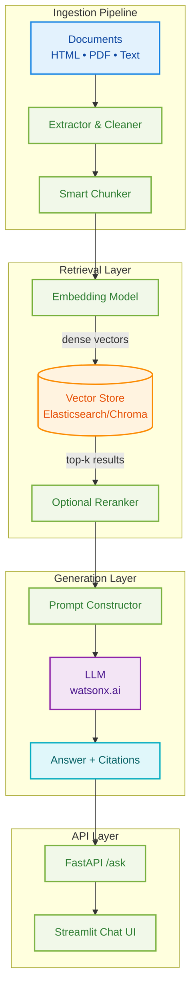

<p align="center">
  <a href="https://www.ibm.com/products/watsonx-ai" target="_blank" rel="noopener">
    
  </a>
  <a href="https://www.python.org" target="_blank" rel="noopener">
    
  </a>
  <a href="https://ruslanmv.com/watsonx-workshop/" target="_blank" rel="noopener">
    
  </a>
</p>

<div align="center">
  <a href="https://www.python.org" target="_blank" rel="noopener">
    
  </a>
  <a href="https://jupyter.org/" target="_blank" rel="noopener">
    
  </a>
</div>

---

## Welcome to the watsonx Workshop Series

A comprehensive, production-ready curriculum designed for enterprise teams building AI solutions with **IBM watsonx**. This hands-on workshop series takes you from foundation to deployment across four intensive days.

### What You'll Build

<div class="grid cards" markdown>

-   :material-brain: **Enterprise LLM Applications**

    Master Granite models, prompt engineering, and safe AI deployment patterns for production environments.

-   :material-database-search: **Production RAG Systems**

    Build retrieval-augmented generation pipelines with vector databases, embedding models, and complete API/UI implementations.

-   :material-robot: **Intelligent Agents**

    Create tool-using agents with governance, multi-agent orchestration, and enterprise integration.

-   :material-cloud-check: **Cloud-Ready Solutions**

    Deploy scalable applications with FastAPI, Streamlit, and containerized workflows.

</div>

---

## Access the Workshop Portal

<div class="portal-box">
  <h3>Ready to Begin Your Learning Journey?</h3>
  <p>Access interactive presentations, daily guides, and comprehensive workshop materials</p>
  <a href="portal/" class="md-button md-button--primary">
    Enter Workshop Portal
  </a>
</div>

!!! tip "Two Learning Paths Available"
    - **Instructor-Led**: Navigate through daily portals with complete teaching guides, timing recommendations, and presentation slides
    - **Self-Paced**: Follow detailed documentation with hands-on labs at your own speed using the sidebar navigation

---

## Workshop Structure

### 5-Day Intensive Curriculum

| Day | Focus Area | Duration | Key Deliverable |
|-----|------------|----------|-----------------|
| **Day 0** | Environment Setup | 4 hours | Working local & cloud environments |
| **Day 1** | LLMs & Prompting | 6 hours | Prompting playbook & safe AI patterns |
| **Day 2** | RAG Systems | 6 hours | Production RAG API + UI with citations |
| **Day 3** | Agents & Orchestration | 6 hours | Multi-agent system with governance |
| **Capstone** | Applied Project | 4 hours | Portfolio-ready enterprise application |

---

## Quick Start

Choose your preferred approach to get started:

<div class="grid cards" markdown>

-   :material-school: __Instructor Portal__

    ---

    Access complete daily guides with presentations, labs, and teaching notes

    [:octicons-arrow-right-16: Open Portal](portal/){ .md-button .md-button--primary }

-   :material-book-open-page-variant: __Documentation__

    ---

    Deep dive into detailed guides and step-by-step tutorials

    [:octicons-arrow-right-16: Browse Docs](tracks/day0-env/prereqs-and-accounts/){ .md-button }

-   :material-rocket-launch-outline: __RAG Accelerator__

    ---

    Jump directly to building production RAG systems

    [:octicons-arrow-right-16: Start Building](tracks/day2-rag/START_HERE/){ .md-button }

-   :material-github: __GitHub Repository__

    ---

    Clone the complete workshop codebase

    [:octicons-arrow-right-16: View on GitHub](https://github.com/ruslanmv/watsonx-workshop){ .md-button target="_blank" }

</div>

---

## Run the RAG Accelerator Locally

Get hands-on immediately with our production-ready RAG implementation:

```bash
# Clone and navigate to accelerator
cd accelerator

# Set up Python environment
python -m venv .venv
source .venv/bin/activate         # Windows: .venv\Scripts\activate

# Install dependencies
pip install -U pip && pip install -e .

# Configure environment
cp .env.sample .env               # Add your watsonx credentials

# Run the pipeline
make all                          # Extract → Chunk → Embed → Index

# Start services
make api                          # FastAPI at http://localhost:8001/health
make ui                           # Streamlit at http://localhost:8501
```

!!! success "What You Get"
    - **FastAPI Backend**: `/ask` endpoint with citations and source tracking
    - **Streamlit UI**: Production-ready chat interface
    - **Vector Store**: Elasticsearch or Chroma backend
    - **Evaluation Tools**: Model comparison and quality metrics

---

## RAG Architecture Overview



---

## What's Included

<div class="grid cards" markdown>

-   :material-file-code: **Production Code**

    ---

    - FastAPI + Streamlit applications
    - Docker configurations
    - CLI tools and scripts
    - Reproducible environments

-   :material-notebook: **Hands-On Labs**

    ---

    - Step-by-step Markdown guides
    - Reference Jupyter notebooks
    - Complete code examples
    - Lab solutions included

-   :material-presentation: **Presentation Slides**

    ---

    - Interactive HTML decks
    - Speaker notes for instructors
    - PDF export capability
    - Theory + practice aligned

-   :material-shield-check: **Enterprise Patterns**

    ---

    - Security best practices
    - Governance workflows
    - Evaluation frameworks
    - Deployment guides

</div>

---

## Prerequisites

Before starting the workshop, ensure you have:

- **IBM Cloud Account** with watsonx.ai access
- **Python 3.11+** installed
- **Git** for repository management
- **Docker** (optional, recommended for isolation)
- **Elasticsearch 8.x** (for RAG labs) or use Chroma locally

!!! note "Detailed Setup Instructions"
    Complete prerequisites and environment setup are covered in [Day 0 - Environment Setup](tracks/day0-env/prereqs-and-accounts/)

---

## Learning Outcomes

By completing this workshop series, you will:

- [x] Deploy and operate Granite LLMs on watsonx.ai
- [x] Implement enterprise-grade RAG systems with vector databases
- [x] Build governed, tool-using AI agents
- [x] Orchestrate multi-agent workflows
- [x] Evaluate and compare model configurations
- [x] Deploy production-ready APIs and UIs
- [x] Apply security and governance best practices

---

## Support & Community

<div class="grid cards" markdown>

-   :material-chat-question: **Get Help**

    ---

    Questions? Join our community discussions

    [:octicons-arrow-right-16: Discussions](https://github.com/ruslanmv/watsonx-workshop/discussions){ .md-button }

-   :material-bug: **Report Issues**

    ---

    Found a bug? Let us know

    [:octicons-arrow-right-16: Issues](https://github.com/ruslanmv/watsonx-workshop/issues){ .md-button }

-   :material-library: **Resources**

    ---

    Additional learning materials

    [:octicons-arrow-right-16: Resources](resources/){ .md-button }

-   :material-web: **Author's Blog**

    ---

    Updates and related content

    [:octicons-arrow-right-16: ruslanmv.com](https://ruslanmv.com){ .md-button target="_blank" }

</div>

---

<div align="center" style="margin-top: 3rem; padding-top: 2rem; border-top: 2px solid var(--md-default-fg-color--lightest);">
  <p style="font-size: 1.1rem; font-weight: 600; margin-bottom: 1rem;">Built with care for the watsonx Community</p>
  <p style="color: var(--md-default-fg-color--light);">
    <a href="https://github.com/ruslanmv/watsonx-workshop">⭐ Star on GitHub</a> •
    <a href="https://github.com/ruslanmv/watsonx-workshop/issues">Report Issue</a> •
    <a href="https://github.com/ruslanmv/watsonx-workshop/discussions">Join Discussion</a>
  </p>
  <p style="color: var(--md-default-fg-color--lighter); font-size: 0.9rem; margin-top: 1.5rem;">
    Copyright © 2025 Ruslan Magana • Licensed under open-source terms
  </p>
</div>