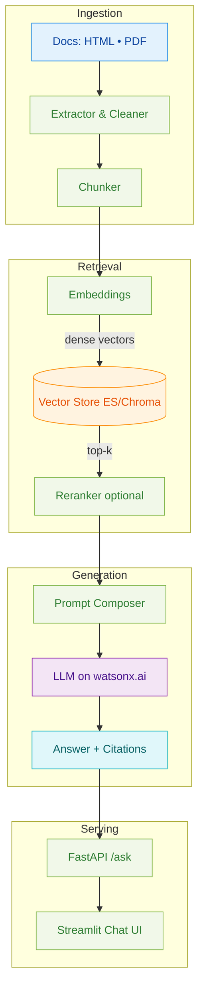

<p align="center">
  <a href="https://www.ibm.com/products/watsonx-ai" target="_blank" rel="noopener">
    
  </a>
  <a href="https://www.python.org" target="_blank" rel="noopener">
    
  </a>
  <a href="https://ruslanmv.com/watsonx-workshop/" target="_blank" rel="noopener">
    
  </a>
</p>

<div align="center">
  <a href="https://www.python.org" target="_blank" rel="noopener">
    
  </a>
  <a href="https://jupyter.org/" target="_blank" rel="noopener">
    
  </a>
</div>

---

## Welcome

The **watsonx Workshop Series** is a hands-on set of tracks that show how to build with IBM watsonx:

- **Day 0 – Environment** — local & cloud setup for the whole week  
- **Day 1 – LLMs & Prompting** — Granite concepts, patterns, and safe prompting  
- **Day 2 – RAG** — retrieval-augmented generation from zero to API & UI  
- **Day 3 – Orchestrate & Agents** — tool-using agents and governance, end-to-end

!!! note "Markdown-First Approach"
    Everything is **Markdown-first** for clean builds. Day-specific notebooks live under:
    
    - `labs-src/` (governance & RAG examples)
    - `docs/assets/notebooks/day3/` (agent notebooks reference)

---

## Quick Start

=== "Browse the Docs"

    1. Use the left sidebar to pick a **Day**.
    2. Follow the pages top-to-bottom; theory first, then labs with solutions.
    3. Start at **Day 0** to prepare both environments.

=== "Run the Accelerator (RAG) Locally"

    ```bash
    # Minimal end-to-end run
    cd accelerator
    python -m venv .venv
    source .venv/bin/activate         # Windows: .venv\Scripts\activate
    pip install -U pip && pip install -e .
    cp .env.sample .env               # fill watsonx + vector backend settings
    make all                          # extract → chunk → index
    make api                          # FastAPI at http://localhost:8001/health
    # in a second terminal:
    make ui                           # Streamlit at http://localhost:8501
    ```

---

## Choose a Track

<div class="grid cards" markdown>

-   :material-laptop-account: __Day 0 – Environment Setup__

    ---

    Prepare **simple-ollama** and **simple-watsonx** envs; verify both.
    
    [:octicons-arrow-right-16: Open](tracks/day0-env/prereqs-and-accounts.md){ .md-button .md-button--primary }

-   :material-brain: __Day 1 – LLMs & Prompting__

    ---

    LLM concepts, prompt patterns & templates, lightweight eval & safety.
    
    [:octicons-arrow-right-16: Open](tracks/day1-llm/llm-concepts.md){ .md-button .md-button--primary }

-   :material-magnify-expand: __Day 2 – RAG__

    ---

    Build a grounded Q&A app (Elasticsearch/Chroma + watsonx.ai), package and evaluate.
    
    [:octicons-arrow-right-16: START HERE](tracks/day2-rag/START_HERE.md){ .md-button .md-button--primary }

-   :material-robot-outline: __Day 3 – Orchestrate & Agents__

    ---

    Agentic AI: CrewAI/LangGraph patterns → **watsonx Orchestrate** with governance.
    
    [:octicons-arrow-right-16: Open](tracks/day3-orchestrate/agentic-ai-overview.md){ .md-button .md-button--primary }

-   :material-rocket-launch-outline: __Capstone (Optional)__

    ---

    Team up to ship a mini project using the accelerator & governance workflow.
    
    [:octicons-arrow-right-16: Open](tracks/capstone/capstone-overview.md){ .md-button }

</div>

---

## Presentation Slides

Use the docs for **step-by-step labs**, and the **slides** for live delivery or sharing with participants.

### HTML Decks (Interactive)

<div class="grid cards" markdown>

-   :material-presentation: __Day 0 – Environment Setup__

    ---

    Environment overview, accounts, and validation of both stacks.

    [:material-monitor-dashboard: View Slides](slides/day0-prereqs-and-accounts.html){ .md-button .md-button--primary }

-   :material-presentation: __Day 1 – LLMs & Prompting__

    ---

    LLM concepts, prompt patterns & templates, eval & safety.

    [:material-monitor-dashboard: View Slides](slides/day1-llm-concepts.html){ .md-button .md-button--primary }

-   :material-presentation: __Day 2 – RAG__

    ---

    RAG architecture, retrieval patterns, and accelerator alignment.

    [:material-monitor-dashboard: View Slides](slides/day2-rag-architecture-overview.html){ .md-button .md-button--primary }

-   :material-presentation: __Day 3 – Orchestrate & Agents__

    ---

    Agentic AI, orchestration, and governance recap.

    [:material-monitor-dashboard: View Slides](slides/day3-agentic-ai-overview.html){ .md-button .md-button--primary }

-   :material-presentation: __Capstone__

    ---

    Project overview, ideas, and framing for the final exercise.

    [:material-monitor-dashboard: View Slides](slides/capstone-overview.html){ .md-button .md-button--primary }

</div>

!!! tip "PDF Export"
    To export slides as PDF, open any HTML deck and use your browser's print function (Ctrl+P / Cmd+P) with "Save as PDF" option.

---

## RAG Track at a Glance

- **Pre-work**: environment, credentials, and sample data  
- **Lab 1**: end-to-end accelerator (HTML/PDF → vectors → API + Streamlit)  
- **Lab 2** *(choose or compare)*:
  - 2A: **Elasticsearch + LangChain**
  - 2B: **Elasticsearch Python SDK** (no LangChain)
  - 2C: **Chroma + LangChain** (local/dev)
- **Lab 3**: **Packaging & Evaluation** with watsonx.governance



---

## Day 3 Agent Notebooks (Reference)

Agent implementation examples for different frameworks:

- `docs/assets/notebooks/day3/agent_crewai.ipynb` — Multi-agent collaboration
- `docs/assets/notebooks/day3/agent_langgraph.ipynb` — Stateful workflows
- `docs/assets/notebooks/day3/agent_watsonx.ipynb` — watsonx Orchestrate integration

!!! info "Lab Integration"
    Use these alongside **Lab 3.1**: [Agent + Accelerator API](tracks/day3-orchestrate/lab-1-agent-watsonx.md).

---

## What's Included

- **Production-ready samples** — FastAPI + Streamlit, CLI, Dockerfiles
- **Reproducible configs** — `.env.sample`, `requirements.txt` / `pyproject.toml`
- **Evaluation workflows** — watsonx.governance for model comparison

!!! tip "Everything is Markdown"
    All labs are follow-along pages. Copy-paste commands and code blocks; notebooks are optional helpers.

---

## Next Steps

<div class="grid cards" markdown>

-   :material-play-circle: __Begin Day 0__
    
    ---
    
    Set up and verify both environments
    
    [:octicons-arrow-right-16: Start](tracks/day0-env/prereqs-and-accounts.md){ .md-button .md-button--primary }

-   :material-rocket-launch: __Jump to RAG__
    
    ---
    
    Start building immediately if ready
    
    [:octicons-arrow-right-16: Go](tracks/day2-rag/START_HERE.md){ .md-button .md-button--primary }

-   :material-book-open-variant: __Resources__
    
    ---
    
    Additional learning materials
    
    [:octicons-arrow-right-16: Browse](resources.md){ .md-button }

</div>

---

<div align="center">
  <p><strong>Built with ❤️ for the watsonx Community</strong></p>
  <p>
    <a href="https://github.com/ruslanmv/watsonx-workshop">⭐ Star on GitHub</a> •
    <a href="https://github.com/ruslanmv/watsonx-workshop/issues">Report Issue</a> •
    <a href="https://github.com/ruslanmv/watsonx-workshop/discussions">Discussions</a>
  </p>
</div>