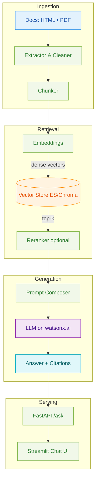

# watsonx Workshop Series

<p align="center">
  <a href="https://www.ibm.com/products/watsonx-ai" target="_blank"></a>
  <a href="https://www.python.org" target="_blank"></a>
  <a href="https://www.docker.com/" target="_blank"></a>
  <a href="https://squidfunk.github.io/mkdocs-material/" target="_blank"></a>
</p>
<div align="center">
  <a href="https://www.python.org" target="_blank"></a>
  <a href="https://www.docker.com/" target="_blank"></a>
  <a href="https://jupyter.org/" target="_blank"></a>
</div>

---

## Welcome

The **watsonx Workshop Series** is a hands-on collection of tracks that teach you how to build with IBM watsonx:

* **Granite** — model capabilities, prompting, local runs, and the watsonx.ai SDK
* **RAG** — retrieval-augmented generation from zero to production packaging
* **Agents** — governed, tool-using agents and evaluation workflows
* **Orchestrate** — end-to-end applied lab tying concepts together

> **Note:** This bundle is 100% **Markdown-first**. Notebooks are included only as references under `labs-src/` so that `mkdocs build --strict` passes cleanly.

---

## Quick Start

=== "Browse the Docs"

    1.  Use the left sidebar to select a **Track**.
    2.  Each track is organized as a sequence of **Labs** with copy-paste runnable code blocks.
    3.  Start with **Granite** if you’re new to watsonx, or jump straight to **RAG**.

=== "Run the RAG App Locally"

    ```bash
    # Lab 1 (Accelerator) — minimal local run
    cd accelerator
    python -m venv .venv
    source .venv/bin/activate         # Windows: .venv\Scripts\activate
    pip install -U pip && pip install -e .
    cp .env.sample .env               # fill in watsonx + vector backend settings
    make all                          # extract → chunk → index
    make api                          # FastAPI at http://localhost:8001/health
    # in a second terminal:
    make ui                           # Streamlit UI at http://localhost:8501
    ```

---

## Choose a Track

<div class="grid cards" markdown="1">
* :material-fire: **Granite**

    ^^^

    Explore Granite model families, prompting patterns, local HF/Ollama, and watsonx.ai SDK. <br><br>

    [:octicons-arrow-right-16: Open »](tracks/granite/labs/pre-work.md){ .md-button .md-button--primary }

* :material-magnify-expand: **RAG**

    ^^^

    Build a grounded Q&A app: ingest → chunk → embed → **Elasticsearch/Chroma** → LLM on **watsonx.ai**.
    Package a CLI/API and compare runs in **Evaluation Studio**. <br><br>

    [:octicons-arrow-right-16: Open »](tracks/rag/labs/pre-work.md){ .md-button .md-button--primary }

* :material-robot-outline: **Agents**

    ^^^

    Tool-using, governed assistants with LangGraph and watsonx.governance; evaluate for quality and risk. <br><br>

    [:octicons-arrow-right-16: Open »](tracks/agents/labs/lab-2-hr-assistant-governed-catalog.md){ .md-button .md-button--primary }

* :material-cube-outline: **Orchestrate**

    ^^^

    A full applied workshop combining components into a cohesive solution. <br><br>

    [:octicons-arrow-right-16: Open »](tracks/orchestrate/orchestrate-workshop.md){ .md-button .md-button--primary }
</div>

---

## RAG Track at a Glance

* **Pre-work**: environment, credentials, and sample data
* **Lab 1**: end-to-end accelerator (HTML/PDF → vectors → API + Streamlit)
* **Lab 2** *(pick one or compare)*:
    * 2A: **Elasticsearch + LangChain**
    * 2B: **Elasticsearch Python SDK** (no LangChain)
    * 2C: **Chroma + LangChain** (local/dev)
* **Lab 3**: **Packaging & Evaluation** with watsonx.governance



---

## What’s Included

* **Production-ready samples** (FastAPI + Streamlit, CLI, Dockerfiles)
* **Reproducible configs** (`.env.sample`, `requirements.txt` / `pyproject.toml`)
* **Evaluation workflows** with **Evaluation Studio** to compare models & parameters

!!! tip "Everything is Markdown"
Each lab is designed to be followed directly from the page. Copy-paste commands and code blocks; notebooks are optional references only.

---

## Next steps

[Next → Granite Pre-work](tracks/granite/labs/pre-work.md){ .md-button .md-button--primary }

[Resources](resources.md){ .md-button .md-button--primary }
