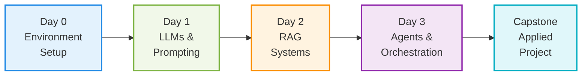

  <h1>🎓 watsonx Workshop Portal</h1>
  
Your comprehensive learning journey through IBM watsonx. Select any day below to access complete guides, presentations, and hands-on materials.

!!! tip "How to Navigate This Portal"
    - **Click "Enter Day Portal"** to access complete daily guides with presentations, labs, and timing
    - Each day includes **interactive slides**, **documentation**, and **hands-on exercises**
    - **Instructor notes** and **timing recommendations** are built into each portal
    - All materials support **both instructor-led and self-paced** learning

---

## Quick Navigation

  

    <h3>📚 Main Documentation</h3>
    
Browse the full docs

    <a href="../" class="md-button md-button--primary">Home</a>
  

  

    <h3>🚀 Quick Start</h3>
    
Begin setup immediately

    <a href="../tracks/day0-env/prereqs-and-accounts/" class="md-button md-button--primary">Setup Guide</a>
  

  

    <h3>💾 GitHub</h3>
    
Clone the repository

    <a href="https://github.com/ruslanmv/watsonx-workshop" class="md-button md-button--primary" target="_blank">Repository</a>
  

  

    <h3>📖 Resources</h3>
    
Additional materials

    <a href="../resources/" class="md-button md-button--primary">Learn More</a>
  

---

<!-- DAY 0 -->

  

    
0

    

      <h2>Environment Setup</h2>
      
Self-Paced | 4 Hours | Foundation

    

  

  

    Prepare your development environment with both local (Ollama) and cloud (watsonx) configurations. This foundational day ensures you have everything needed for the complete workshop series.
  

  
<strong>What You'll Accomplish:</strong>

  <ul>
    <li>Set up IBM Cloud account and watsonx.ai access</li>
    <li>Configure local development environment with Ollama</li>
    <li>Install required software and dependencies</li>
    <li>Verify both environments are operational</li>
  </ul>

  

    <a href="day0-portal/" class="portal-button">📋 Enter Day 0 Portal</a>
  

<!-- DAY 1 -->

  

    
1

    

      <h2>LLMs & Prompting</h2>
      
Tuesday | 6 Hours | Foundation Concepts

    

  

  

    Master the fundamentals of Large Language Models with IBM's Granite family. Learn effective prompting strategies, evaluation techniques, and responsible AI practices through hands-on exercises.
  

  
<strong>What You'll Learn:</strong>

  <ul>
    <li>LLM architecture and transformer fundamentals</li>
    <li>Prompt engineering patterns and templates</li>
    <li>Chain-of-thought and few-shot learning techniques</li>
    <li>Model evaluation metrics and safety considerations</li>
  </ul>

  

    <a href="day1-portal/" class="portal-button">🧠 Enter Day 1 Portal</a>
  

<!-- DAY 2 -->

  

    
2

    

      <h2>Retrieval-Augmented Generation (RAG)</h2>
      
Wednesday | 6 Hours | Production Systems

    

  

  

    Build enterprise-grade RAG applications from scratch. Work with vector databases, embedding models, and deploy complete API/UI implementations ready for production use.
  

  
<strong>What You'll Build:</strong>

  <ul>
    <li>End-to-end document processing pipeline</li>
    <li>Vector database integration (Elasticsearch or Chroma)</li>
    <li>Production-ready FastAPI backend with citations</li>
    <li>Interactive Streamlit chat interface</li>
    <li>Model evaluation and comparison workflows</li>
  </ul>

  

    <a href="day2-portal/" class="portal-button">🏗️ Enter Day 2 Portal</a>
  

<!-- DAY 3 -->

  

    
3

    

      <h2>Agents & Orchestration</h2>
      
Thursday | 6 Hours | Advanced AI Systems

    

  

  

    Create intelligent agents with tool-using capabilities, multi-agent collaboration, and enterprise governance. Integrate with watsonx Orchestrate for production-ready orchestration.
  

  
<strong>What You'll Implement:</strong>

  <ul>
    <li>Tool-using agents with ReAct patterns</li>
    <li>Multi-agent workflows with CrewAI and LangGraph</li>
    <li>watsonx.governance integration for evaluation</li>
    <li>watsonx Orchestrate connections and flows</li>
    <li>Enterprise governance and security patterns</li>
  </ul>

  

    <a href="day3-portal/" class="portal-button">🤖 Enter Day 3 Portal</a>
  

<!-- CAPSTONE -->

  

    
🏆

    

      <h2>Capstone Project</h2>
      
Friday | 4 Hours | Applied Learning

    

  

  

    Apply everything you've learned in a comprehensive team project. Choose from curated project ideas or design your own custom AI application using the skills and patterns from Days 0-3.
  

  
<strong>Project Options Include:</strong>

  <ul>
    <li>Custom RAG application for specific domain</li>
    <li>Multi-agent research or analysis system</li>
    <li>Enterprise knowledge management solution</li>
    <li>Your own innovative AI application</li>
  </ul>

  

    <a href="capstone-portal/" class="portal-button">🎓 Enter Capstone Portal</a>
  

---

## Workshop Learning Path

Track your progress through the complete curriculum:

---

## For Instructors

-   :material-presentation-play: **Complete Teaching Materials**

    ---

    Each daily portal includes:

    - Detailed session agendas with timing
    - Interactive presentation slides
    - Instructor notes and tips
    - Common troubleshooting guidance

-   :material-clock-outline: **Flexible Scheduling**

    ---

    - Recommended timings for each module
    - Built-in break schedules
    - Lab time estimates
    - Adjust pacing based on audience

-   :material-account-group: **Student Resources**

    ---

    - Share portal links for easy access
    - All materials support self-paced learning
    - Lab solutions available
    - Discussion forum integration

-   :material-download: **Offline Capability**

    ---

    - Download complete repository
    - Export slides to PDF
    - All labs work offline
    - Docker for isolated environments

---

  <h2>Ready to Start?</h2>
  
Select any day above to begin your watsonx learning journey

  

    <a href="day0-portal/" class="md-button md-button--primary" style="margin: 0.5rem;">
      🚀 Start with Day 0
    </a>
    <a href="../tracks/day0-env/prereqs-and-accounts/" class="md-button" style="margin: 0.5rem;">
      📚 Browse Documentation
    </a>
  

  

  
<strong>Need Help?</strong>

  

    <a href="https://github.com/ruslanmv/watsonx-workshop/discussions">💬 Discussions</a> •
    <a href="https://github.com/ruslanmv/watsonx-workshop/issues">🐛 Report Issues</a> •
    <a href="../resources/">📖 Resources</a>
  

  

    Built with care for the watsonx Community 
    Copyright © 2025 Ruslan Magana
  

