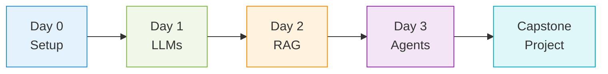

  <h1>🎓 watsonx Workshop Portal</h1>
  
Welcome to your comprehensive learning journey. Select any day below to access interactive presentations and workshop materials.

!!! tip "How to Use This Portal"
    - **Click any presentation card** to open the interactive slide deck
    - **Use arrow keys** to navigate through slides
    - **Press 'S'** for speaker notes (instructors)
    - **Press 'F'** for full-screen mode
    - **Press 'Esc'** for slide overview
    - **Print to PDF** using your browser (Ctrl+P / Cmd+P)

---

## Quick Navigation

  

    <h3>📚 Documentation</h3>
    
Detailed written guides

    <a href="../" class="md-button md-button--primary">Browse Docs</a>
  

  

    <h3>🚀 Quick Start</h3>
    
Get started immediately

    <a href="../tracks/day0-env/prereqs-and-accounts/" class="md-button md-button--primary">Setup Guide</a>
  

  

    <h3>💾 GitHub</h3>
    
Source code & examples

    <a href="https://github.com/ruslanmv/watsonx-workshop" class="md-button md-button--primary" target="_blank">Repository</a>
  

  

    <h3>📖 Resources</h3>
    
Additional materials

    <a href="../resources/" class="md-button md-button--primary">Learn More</a>
  

---

<!-- DAY 0 -->

  

    
0

    

      <h2>Environment Setup</h2>
      
Monday | Self-Paced | Foundational Setup

    

  

  
Prepare your development environment with both local (Ollama) and cloud (watsonx) configurations. This day ensures you have everything needed for the workshop.

  

    <a href="../slides/day0-prereqs-and-accounts.html" class="presentation-card">
      🔑
      
Prerequisites & Accounts

      
Required accounts, API keys, and software prerequisites for the workshop

      

        ⏱️ 20 min
        SETUP
      

    </a>

    <a href="../slides/day0-setup-simple-ollama-environment.html" class="presentation-card">
      🐋
      
Setup Ollama Environment

      
Local LLM environment with Docker and Ollama for offline experimentation

      

        ⏱️ 30 min
        LAB
      

    </a>

    <a href="../slides/day0-setup-simple-watsonx-environment.html" class="presentation-card">
      ☁️
      
Setup watsonx Environment

      
IBM watsonx cloud configuration and API integration setup

      

        ⏱️ 30 min
        LAB
      

    </a>

    <a href="../slides/day0-verify-environments.html" class="presentation-card">
      ✅
      
Verify Environments

      
Test both environments to ensure proper configuration

      

        ⏱️ 15 min
        VALIDATION
      

    </a>
  

<!-- DAY 1 -->

  

    
1

    

      <h2>LLMs & Prompting</h2>
      
Tuesday | 6 Hours | Foundation Concepts

    

  

  
Master the fundamentals of Large Language Models and develop effective prompting strategies. Learn through hands-on exercises in both Ollama and watsonx environments.

  

    <a href="../slides/day1-llm-concepts.html" class="presentation-card">
      🧠
      
LLM Concepts & Architecture

      
Understanding transformers, attention mechanisms, and model architectures

      

        ⏱️ 90 min
        THEORY
      

    </a>

    <a href="../slides/day1-prompt-patterns-theory.html" class="presentation-card">
      📝
      
Prompt Patterns & Templates

      
Chain-of-thought, few-shot learning, and advanced prompting techniques

      

        ⏱️ 90 min
        THEORY
      

    </a>

    <a href="../slides/day1-eval-safety-theory.html" class="presentation-card">
      🛡️
      
Evaluation & Safety

      
Model evaluation metrics, safety considerations, and responsible AI

      

        ⏱️ 60 min
        THEORY
      

    </a>

    <a href="../slides/day1-summary-and-schedule.html" class="presentation-card">
      📋
      
Day 1 Summary

      
Recap of key concepts and preview of Day 2 RAG systems

      

        ⏱️ 30 min
        RECAP
      

    </a>
  

  

    <strong>📖 Lab Materials:</strong> Access hands-on exercises in the
    <a href="../tracks/day1-llm/lab-1-quickstart-two-envs/">documentation section</a>
  

<!-- DAY 2 -->

  

    
2

    

      <h2>Retrieval-Augmented Generation (RAG)</h2>
      
Wednesday | 6 Hours | Production Systems

    

  

  
Build production-ready RAG applications with vector databases, embedding models, and complete API/UI implementations. Choose between Elasticsearch and Chroma backends.

  

    <a href="../slides/day2-rag-architecture-overview.html" class="presentation-card">
      🏗️
      
RAG Architecture Overview

      
End-to-end RAG pipeline: ingestion, retrieval, generation, and serving

      

        ⏱️ 90 min
        THEORY
      

    </a>
  

  

    <strong>🚀 Comprehensive Labs:</strong> Day 2 features extensive hands-on work. Start with
    <a href="../tracks/day2-rag/START_HERE/">START HERE guide</a> which includes:
    <ul style="margin: 0.5rem 0 0 1.5rem;">
      <li><strong>Lab 1:</strong> End-to-end accelerator setup</li>
      <li><strong>Lab 2A:</strong> Elasticsearch + LangChain</li>
      <li><strong>Lab 2B:</strong> Elasticsearch Python SDK</li>
      <li><strong>Lab 2C:</strong> Chroma + LangChain</li>
      <li><strong>Lab 3:</strong> Packaging & Evaluation</li>
    </ul>
  

<!-- DAY 3 -->

  

    
3

    

      <h2>Agents & Orchestration</h2>
      
Thursday | 6 Hours | Advanced AI Systems

    

  

  
Create intelligent agents capable of using tools, multi-agent collaboration, and integrate with watsonx Orchestrate for enterprise governance.

  

    <a href="../slides/day3-agentic-ai-overview.html" class="presentation-card">
      🤖
      
Agentic AI Overview

      
Agent frameworks: CrewAI, LangGraph, and ReAct patterns

      

        ⏱️ 90 min
        THEORY
      

    </a>

    <a href="../slides/day3-bridge-orchestrate-governance.html" class="presentation-card">
      ⚙️
      
Orchestrate & Governance

      
Enterprise orchestration with watsonx and governance workflows

      

        ⏱️ 90 min
        THEORY
      

    </a>

    <a href="../slides/day3-recap-and-next-steps.html" class="presentation-card">
      🎯
      
Recap & Next Steps

      
Workshop recap, best practices, and production deployment guidance

      

        ⏱️ 60 min
        RECAP
      

    </a>
  

  

    <strong>🔬 Agent Notebooks:</strong> Explore reference implementations in the
    <a href="../tracks/day3-orchestrate/lab-1-agent-watsonx/">Day 3 labs</a>:
    <ul style="margin: 0.5rem 0 0 1.5rem;">
      <li>CrewAI multi-agent collaboration</li>
      <li>LangGraph stateful workflows</li>
      <li>watsonx Orchestrate integration</li>
    </ul>
  

<!-- CAPSTONE -->

  

    
🏆

    

      <h2>Capstone Project</h2>
      
Friday | 4 Hours | Applied Learning

    

  

  
Apply everything you've learned in a comprehensive team project. Choose from suggested ideas or create your own custom application.

  

    <a href="../slides/capstone-overview.html" class="presentation-card">
      🎓
      
Capstone Overview

      
Project structure, requirements, and team formation guidelines

      

        ⏱️ 30 min
        PROJECT
      

    </a>

    <a href="../slides/capstone-project-ideas.html" class="presentation-card">
      💡
      
Project Ideas

      
Curated project suggestions across different domains and complexity levels

      

        ⏱️ 30 min
        IDEATION
      

    </a>
  

  

    <strong>🚀 Project Resources:</strong> Access complete
    <a href="../tracks/capstone/capstone-overview/">capstone documentation</a> including:
    <ul style="margin: 0.5rem 0 0 1.5rem;">
      <li>Project templates and scaffolding</li>
      <li>Evaluation criteria and rubrics</li>
      <li>Presentation guidelines</li>
      <li>Example submissions</li>
    </ul>
  

---

## For Instructors

-   :material-presentation-play: **Presentation Mode**

    ---

    - All slides support speaker notes (press 'S')
    - Full-screen mode available (press 'F')
    - Slide overview for navigation (press 'Esc')
    - Export to PDF for offline use

-   :material-clock-outline: **Timing Guidance**

    ---

    - Presentation duration shown on each card
    - Built-in breaks and Q&A time
    - Flexible pacing based on audience
    - Lab time estimates in documentation

-   :material-account-group: **Student Resources**

    ---

    - Share portal link for easy access
    - Documentation provides detailed steps
    - Lab solutions available for reference
    - Discussion forum for Q&A

-   :material-download: **Offline Access**

    ---

    - Download repository for local use
    - Print slides to PDF if needed
    - All materials work offline
    - Docker for isolated environments

---

## Workshop Completion Path

Track your progress through the complete workshop:

---

  <h2>Ready to Start Learning?</h2>
  
Select any day above to begin your watsonx journey

  

    <a href="../tracks/day0-env/prereqs-and-accounts/" class="md-button md-button--primary" style="margin: 0.5rem;">
      📚 Start with Documentation
    </a>
    <a href="../slides/day0-prereqs-and-accounts.html" class="md-button md-button--primary" style="margin: 0.5rem;">
      🎬 Jump to Presentations
    </a>
  

  

  
<strong>Need Help?</strong>

  

    <a href="https://github.com/ruslanmv/watsonx-workshop/discussions">💬 Discussions</a> •
    <a href="https://github.com/ruslanmv/watsonx-workshop/issues">🐛 Issues</a> •
    <a href="../resources/">📖 Resources</a>
  

  

    Built with ❤️ for the watsonx Community 
    Copyright © 2025 — Ruslan Magana
  

