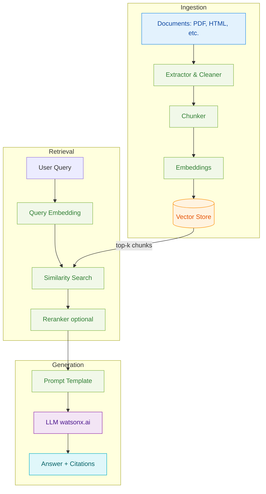

# Day 2 Portal: Retrieval-Augmented Generation (RAG)

## 📋 Daily Overview

- **Duration**: 8 hours (9:00 AM - 5:00 PM)
- **Format**: 4 hours theory (morning) + 4 hours labs (afternoon)
- **Learning Objectives**:
  - Understand RAG architecture and retrieval patterns
  - Build end-to-end RAG pipeline from documents to answers
  - Compare vector database options (Elasticsearch vs. Chroma)
  - Implement evaluation frameworks for RAG systems
- **Prerequisites**: ✅ [Day 1 LLM & Prompting Complete](day1-portal.md)

---

## ☀️ Morning Session: RAG Theory & Architecture (9:00 AM - 12:00 PM)

### Module 2.0: RAG Architecture Overview (9:00 - 10:30, 90 min)

**Content**:

- 📖 [Read: RAG Architecture Overview](../tracks/day2-rag/Theory_01_RAG_Architecture_Overview.md)
- 🎯 [Present: RAG Architecture Slides (HTML)](../slides/day2-rag-architecture-overview.html)
- 📄 [Download: RAG Architecture Slides (PDF)](../slides/day2-rag-architecture-overview.pdf)

**Topics Covered**:

- What is RAG and why do we need it? (grounding LLM responses)
- RAG pipeline components: Ingestion → Retrieval → Generation
- Document processing: extraction, chunking, embedding
- Vector databases and similarity search
- Prompt engineering for RAG

**Instructor Notes**:

!!! tip "Key Concept: RAG vs. Fine-tuning"
    **RAG**: Add external knowledge at runtime (dynamic, up-to-date)
    **Fine-tuning**: Bake knowledge into model weights (static, expensive)

    **When to use RAG**:
    - Knowledge changes frequently (docs, policies, news)
    - Need source attribution (citations)
    - Multiple knowledge domains

    **When to fine-tune**:
    - Specific writing style or tone
    - Consistent reasoning patterns
    - Proprietary knowledge that won't change

!!! warning "Common Misconception"
    Students often think RAG "teaches" the model new facts.
    **Reality**: RAG provides context in the prompt. The model still generates based on its training.

**Suggested Pacing**:

- 0-30 min: RAG motivation and high-level architecture
- 30-60 min: Document processing pipeline (chunking strategies)
- 60-90 min: Vector search and retrieval techniques

**RAG Architecture Diagram**:



☕ **Break**: 10:30 - 10:45 (15 min)

---

### Module 2.1: Vector Databases & Retrieval Strategies (10:45 - 12:00, 75 min)

**Content**:

- 📖 [Read: RAG Workshop README](../tracks/day2-rag/Day2_RAG_Workshop_README.md)
- 🎯 [Present: Retrieval Strategies (in slides)](../slides/day2-rag-architecture-overview.html#retrieval)

**Topics Covered**:

- Vector databases: Elasticsearch, Chroma, Pinecone, Weaviate
- Similarity metrics: cosine, dot product, Euclidean distance
- Hybrid search: combining dense and sparse retrieval
- Reranking for improved relevance
- Production considerations: scaling, latency, cost

**Instructor Notes**:

!!! tip "Vector DB Comparison"
    | Database | Best For | Pros | Cons |
    |----------|----------|------|------|
    | **Elasticsearch** | Enterprise, existing ES users | Mature, hybrid search | Complex setup |
    | **Chroma** | Development, prototyping | Simple, embedded | Limited scale |
    | **Pinecone** | Managed, cloud-native | Fully managed, fast | Cost, vendor lock-in |
    | **Weaviate** | GraphQL, semantic search | Modern API | Newer, smaller community |

!!! example "Live Demo: Retrieval Quality"
    **Show impact of chunk size**:
    1. Query: "What is the refund policy?"
    2. **Small chunks (128 tokens)**: Precise but may miss context
    3. **Large chunks (512 tokens)**: More context but less precise
    4. **Debrief**: Chunk size is a hyperparameter to tune!

**Suggested Pacing**:

- 0-20 min: Vector database options and trade-offs
- 20-40 min: Similarity search and retrieval metrics
- 40-60 min: Advanced techniques (hybrid search, reranking)
- 60-75 min: Production deployment considerations

🍴 **Lunch Break**: 12:00 - 1:00 PM (60 min)

---

## 🔬 Afternoon Session: Hands-On RAG Labs (1:00 PM - 5:00 PM)

### Lab 2.0: Accelerator Quick Start (1:00 - 2:30, 90 min)

**Objectives**:

- Run the complete RAG accelerator end-to-end
- Ingest documents and build vector index
- Query the RAG system via API and UI
- Understand the full pipeline in action

<div class="grid cards" markdown>

-   :material-file-document-multiple: __Ingestion__

    ---

    Process HTML/PDF → chunks → embeddings

    - Extract text from documents
    - Chunk into 256-token segments
    - Generate embeddings with watsonx

-   :material-database-search: __Indexing__

    ---

    Store embeddings in vector database

    - Elasticsearch or Chroma backend
    - Index metadata for filtering
    - Optimize for similarity search

-   :material-api: __API__

    ---

    FastAPI endpoint for RAG queries

    - `/ask` endpoint for Q&A
    - `/health` for monitoring
    - JSON request/response

-   :material-chat: __UI__

    ---

    Streamlit chat interface

    - Interactive Q&A
    - Source citation display
    - Response time metrics

</div>

**Instructions**:

- 📝 [START HERE - Quick Start Guide](../tracks/day2-rag/START_HERE.md)
- 📖 [Detailed Accelerator Guide](../tracks/day2-rag/SUPPLEMENTARY_QUICK_START.md)
- 💡 [Troubleshooting Common Issues](../tracks/day2-rag/Day2_RAG_Workshop_README.md#troubleshooting)

**For Instructors Only**:

- ✅ [Complete Solutions](../tracks/day2-rag/Day2_RAG_Complete_Solutions_Guide.md)
- 📊 [Instructor Guide](../tracks/day2-rag/Day2_RAG_Instructor_Guide.md)

**Success Criteria**:

- [ ] Documents ingested and indexed successfully
- [ ] API responds to `/ask` queries with citations
- [ ] Streamlit UI displays answers with sources
- [ ] Can explain each pipeline stage (ingestion → retrieval → generation)

**Typical Completion Time**: 75 minutes (15 min buffer for troubleshooting)

!!! tip "Instructor Demo Flow"
    **Part 1: Ingestion** (20 min):
    ```bash
    # Show directory structure
    tree data/

    # Run ingestion
    make ingest

    # Inspect vector store
    # Show chunk count, sample embeddings
    ```

    **Part 2: API** (15 min):
    ```bash
    # Start API
    make api

    # Test with curl
    curl -X POST http://localhost:8001/ask \
      -H "Content-Type: application/json" \
      -d '{"query": "What is RAG?"}'
    ```

    **Part 3: UI** (10 min):
    ```bash
    # Start Streamlit
    make ui

    # Demo chat interaction
    # Highlight source citations
    ```

☕ **Break**: 2:30 - 2:45 PM (15 min)

---

### Lab 2.1: Build Your Own RAG (Choose Your Path) (2:45 - 4:15, 90 min)

**Objectives**:

- Implement RAG from scratch with chosen vector database
- Understand internal workings of each component
- Compare approaches and make architecture decisions

**Choose One Path** (or try multiple if time permits):

<div class="grid cards" markdown>

-   :material-elasticsearch: __Path A: Elasticsearch + LangChain__

    ---

    Enterprise-grade, hybrid search

    - Elasticsearch Cloud setup
    - LangChain integration
    - Best for: Production systems

    [:octicons-arrow-right-16: Instructions](../tracks/day2-rag/Day2_RAG_Workshop_README.md#lab-2a-elasticsearch-langchain)

-   :material-elasticsearch: __Path B: Elasticsearch Python SDK__

    ---

    No framework, pure Python

    - Direct Elasticsearch API
    - Full control over pipeline
    - Best for: Learning internals

    [:octicons-arrow-right-16: Instructions](../tracks/day2-rag/Day2_RAG_Workshop_README.md#lab-2b-elasticsearch-python)

-   :material-database: __Path C: Chroma + LangChain__

    ---

    Local, lightweight, fast setup

    - Embedded Chroma database
    - LangChain integration
    - Best for: Development, prototyping

    [:octicons-arrow-right-16: Instructions](../tracks/day2-rag/Day2_RAG_Workshop_README.md#lab-2c-chroma-langchain)

</div>

**Instructions**:

- 📝 [Lab 2 Workshop Guide](../tracks/day2-rag/Day2_RAG_Workshop_README.md)
- 💡 [Vector DB Comparison](../tracks/day2-rag/Day2_RAG_Instructor_Guide.md#vector-database-comparison)

**For Instructors Only**:

- ✅ [Complete Solutions (All Paths)](../tracks/day2-rag/Day2_RAG_Complete_Solutions_Guide.md)
- 🎯 [Path Selection Guidance](../tracks/day2-rag/Day2_RAG_Instructor_Guide.md#lab-path-selection)

**Success Criteria** (per path):

- [ ] Vector database connected and operational
- [ ] Documents chunked and embedded correctly
- [ ] Similarity search returns relevant results
- [ ] LLM generates answers with retrieved context
- [ ] Can compare chosen approach to others

!!! example "Challenge for Fast Finishers"
    **Extension 1**: Implement reranking with cross-encoder model
    **Extension 2**: Add metadata filtering (by date, category, etc.)
    **Extension 3**: Build hybrid search (dense + sparse retrieval)

---

### Lab 2.2: RAG Evaluation & Optimization (4:15 - 5:00, 45 min)

**Objectives**:

- Design evaluation metrics for RAG systems
- Measure retrieval quality and generation accuracy
- Identify and fix common RAG failure modes

**Instructions**:

- 📝 [Evaluation Guide](../tracks/day2-rag/Day2_RAG_Workshop_README.md#lab-3-evaluation)
- 💡 [watsonx.governance Integration](../tracks/day2-rag/Day2_Supplementary_Material_Accelerator_IBM_Tooling.md)

**For Instructors Only**:

- ✅ [Evaluation Solutions](../tracks/day2-rag/Day2_RAG_Complete_Solutions_Guide.md#lab-3-evaluation)
- 📊 [Example Metrics Dashboard](../tracks/day2-rag/Day2_RAG_Instructor_Guide.md#evaluation-metrics)

**Key Metrics**:

**Retrieval Metrics**:
- Precision@k: Relevant docs in top-k results
- Recall@k: Coverage of all relevant docs
- MRR (Mean Reciprocal Rank): Position of first relevant result

**Generation Metrics**:
- Answer Relevance: Does answer address the question?
- Faithfulness: Is answer grounded in retrieved context?
- Citation Quality: Are sources correctly attributed?

**Success Criteria**:

- [ ] Evaluation dataset created (10+ query-answer pairs)
- [ ] Retrieval metrics calculated and analyzed
- [ ] Generation quality assessed (manual or automated)
- [ ] At least one optimization implemented and measured

!!! warning "Common RAG Failure Modes"
    1. **Retrieval Fails**: Query doesn't match relevant chunks
       - **Fix**: Improve chunking, add query expansion, use hybrid search

    2. **Context Too Long**: Retrieved chunks exceed LLM context window
       - **Fix**: Implement reranking, reduce chunk size, use summarization

    3. **Hallucination**: LLM ignores context and makes things up
       - **Fix**: Stronger prompt engineering, citation requirements, faithfulness checks

    4. **Outdated Info**: Vector store has stale data
       - **Fix**: Implement incremental updates, versioning, timestamp filtering

🎯 **Wrap-Up & Q&A**: 5:00 PM (30 min, may extend slightly)

**Discussion Prompts**:

- "What was the most challenging part of building RAG today?"
- "Which vector database did you choose and why?"
- "What RAG optimization had the biggest impact?"

**Preview Tomorrow (Day 3)**:

- Today: RAG gives LLMs access to your data
- Tomorrow: Agents give LLMs ability to take actions
- Bridge: "RAG is retrieval. Agents add tools and decision-making."

---

## 📚 Quick Reference

### All Day 2 Materials

<div class="grid cards" markdown>

-   :material-book-open-page-variant: __Theory & Slides__

    ---

    - [RAG Architecture Overview](../tracks/day2-rag/Theory_01_RAG_Architecture_Overview.md) | [Slides](../slides/day2-rag-architecture-overview.html)
    - [Workshop README](../tracks/day2-rag/Day2_RAG_Workshop_README.md)

-   :material-flask-outline: __Labs & Solutions__

    ---

    - [START HERE - Quick Start](../tracks/day2-rag/START_HERE.md)
    - [Supplementary Quick Start](../tracks/day2-rag/SUPPLEMENTARY_QUICK_START.md)
    - [Complete Solutions Guide](../tracks/day2-rag/Day2_RAG_Complete_Solutions_Guide.md)

-   :material-file-document-outline: __Instructor Resources__

    ---

    - [Instructor Guide](../tracks/day2-rag/Day2_RAG_Instructor_Guide.md)
    - [Accelerator & IBM Tooling](../tracks/day2-rag/Day2_Supplementary_Material_Accelerator_IBM_Tooling.md)

-   :material-tools: __Accelerator Tools__

    ---

    - [Accelerator Repository](../../accelerator/)
    - [FastAPI Documentation](../../accelerator/api/)
    - [Streamlit UI Guide](../../accelerator/ui/)

</div>

### Navigation

- [⬅️ Previous: Day 1 - LLMs & Prompting](day1-portal.md)
- [➡️ Next: Day 3 - Orchestration & Agents](day3-portal.md)
- [🏠 Workshop Home](../index.md)
- [📚 All Resources](../resources.md)

---

## 🎯 Learning Outcomes

By the end of Day 2, participants will be able to:

1. ✅ **Explain** RAG architecture and when to use it vs. fine-tuning
2. ✅ **Build** end-to-end RAG pipeline from documents to Q&A system
3. ✅ **Compare** vector database options and select appropriate one
4. ✅ **Implement** document ingestion, chunking, and embedding strategies
5. ✅ **Evaluate** RAG system quality with retrieval and generation metrics
6. ✅ **Optimize** RAG performance by tuning hyperparameters and prompts

---

## 🔧 Troubleshooting

### Common Issues During Day 2

??? question "Elasticsearch connection refused"
    **Symptoms**: `ConnectionError: Connection refused` or timeout

    **Causes**:
    - Elasticsearch not running
    - Wrong host/port configuration
    - Firewall blocking connection

    **Solution**:
    ```bash
    # Check if Elasticsearch is running
    curl http://localhost:9200

    # If using Elasticsearch Cloud, verify credentials
    cat .env | grep ELASTIC_

    # Test connection with Python
    from elasticsearch import Elasticsearch
    es = Elasticsearch(["http://localhost:9200"])
    print(es.info())  # Should return cluster info
    ```

    [Detailed Guide →](../tracks/day2-rag/Day2_RAG_Workshop_README.md#elasticsearch-troubleshooting)

??? question "Chroma database corrupted or locked"
    **Symptoms**: `Database is locked` or `Chroma client error`

    **Cause**: Previous process didn't close cleanly

    **Solution**:
    ```bash
    # Remove Chroma database and recreate
    rm -rf ./chroma_db/

    # Re-run ingestion
    python ingest.py
    ```

??? question "Embedding generation is too slow"
    **Symptoms**: Ingestion takes >5 min per document

    **Causes**:
    - Too many API calls to watsonx.ai (not batching)
    - Large chunk sizes
    - Network latency

    **Solution**:
    ```python
    # Batch embeddings instead of one-by-one
    chunks = ["chunk1", "chunk2", "chunk3", ...]

    # Bad: Loop with individual calls
    for chunk in chunks:
        embed = embed_model.embed_query(chunk)  # 100 API calls!

    # Good: Batch call
    embeddings = embed_model.embed_documents(chunks)  # 1 API call!
    ```

??? question "Retrieved chunks are not relevant"
    **Symptoms**: RAG returns wrong sources, answers are off-topic

    **Diagnostic**:
    1. Check chunk size (too large → noisy, too small → missing context)
    2. Inspect actual chunks in vector store
    3. Test similarity search directly (bypass LLM)

    **Solution**:
    ```python
    # Debug retrieval separately
    query = "What is the refund policy?"
    results = vector_store.similarity_search(query, k=5)

    for i, doc in enumerate(results):
        print(f"\n=== Chunk {i} (score: {doc.metadata.get('score')}) ===")
        print(doc.page_content)

    # If chunks are bad, try:
    # 1. Smaller chunk size (256 → 128 tokens)
    # 2. Overlap between chunks (50 tokens)
    # 3. Different embedding model
    ```

??? question "LLM ignores retrieved context (hallucination)"
    **Symptoms**: Answer doesn't use provided sources

    **Cause**: Weak prompt engineering

    **Solution**:
    ```python
    # Weak prompt (LLM may ignore context)
    prompt = f"Context: {context}\n\nQuestion: {query}\nAnswer:"

    # Strong prompt (forces grounding)
    prompt = f"""Use ONLY the following context to answer the question.
    If the answer is not in the context, say "I don't have enough information."

    Context:
    {context}

    Question: {query}

    Answer (cite sources):"""
    ```

    [Prompt Engineering for RAG →](../tracks/day2-rag/Day2_RAG_Workshop_README.md#prompt-engineering)

---

## 📊 Teaching Notes

### Recommended Pacing Adjustments

**If Running Behind** (>15 min late):

- ⏭️ Skip advanced retrieval strategies (reranking, hybrid search)
- ⏭️ Demo Lab 2.0 accelerator instead of having students run it
- ⏭️ In Lab 2.1, recommend Chroma path (fastest setup)
- ⏭️ Assign evaluation (Lab 2.2) as homework

**If Running Ahead** (>15 min early):

- ➕ Add advanced chunking strategies (semantic chunking, recursive splitting)
- ➕ Demonstrate reranking with cross-encoder
- ➕ Explore metadata filtering and hybrid search
- ➕ Have students present their RAG system design choices

### Lab Path Selection Guidance

**For Beginners**:
- **Recommend**: Path C (Chroma + LangChain)
- **Why**: Fastest setup, abstractions hide complexity
- **Goal**: Understand RAG concepts without infrastructure headaches

**For Experienced Developers**:
- **Recommend**: Path B (Elasticsearch Python SDK)
- **Why**: Full control, no "magic" frameworks
- **Goal**: Understand exactly what's happening at each stage

**For Production Focus**:
- **Recommend**: Path A (Elasticsearch + LangChain)
- **Why**: Enterprise-grade, scalable, hybrid search
- **Goal**: Build system that can scale to production

---

## 📝 Daily Schedule (At-a-Glance)

```mermaid
gantt
    title Day 2: RAG Schedule
    dateFormat HH:mm
    axisFormat %H:%M

    section Morning Theory
    Module 2.0: RAG Architecture       :09:00, 90m
    Break                              :10:30, 15m
    Module 2.1: Vector DBs & Retrieval :10:45, 75m
    Lunch                              :12:00, 60m

    section Afternoon Labs
    Lab 2.0: Accelerator Quick Start   :13:00, 90m
    Break                              :14:30, 15m
    Lab 2.1: Build Your Own RAG        :14:45, 90m
    Lab 2.2: Evaluation & Optimization :16:15, 45m
```

---

## 💬 Common Student Questions

### Conceptual Questions

??? question "Q: When should I use RAG vs. fine-tuning?"
    **Decision Framework**:

    | Criterion | RAG | Fine-tuning |
    |-----------|-----|-------------|
    | **Knowledge changes frequently** | ✅ Yes | ❌ No (retrain needed) |
    | **Need source attribution** | ✅ Yes | ❌ No |
    | **Limited training data** | ✅ Yes | ❌ No (needs 1000s examples) |
    | **Want specific writing style** | ❌ Limited | ✅ Yes |
    | **Reasoning patterns** | ❌ Limited | ✅ Yes |
    | **Budget** | 💰 Lower | 💰💰💰 Higher |

    **Best Practice**: Use BOTH
    - Fine-tune for style and reasoning
    - RAG for up-to-date facts and citations

??? question "Q: How do I choose chunk size?"
    **Trade-offs**:

    | Chunk Size | Pros | Cons |
    |------------|------|------|
    | **Small (128 tokens)** | Precise matching | May miss context |
    | **Medium (256-512)** | Balanced | Most common choice |
    | **Large (1024+)** | Full context | Noisy, expensive |

    **Recommendation**: Start with 256 tokens, 50-token overlap. Tune based on evaluation.

    **Advanced**: Semantic chunking (split by topic, not token count)

??? question "Q: What's the difference between vector search and keyword search?"
    **Keyword Search (BM25)**:
    - Matches exact words: "refund policy" finds documents with those words
    - Fast, simple, good for precise terms
    - Misses synonyms: "return policy" won't match

    **Vector Search (Dense Retrieval)**:
    - Matches semantic meaning: "refund policy" also finds "return process", "money back guarantee"
    - Slower, requires embeddings
    - Better for natural language queries

    **Best**: Hybrid search (combine both!)

### Technical Questions

??? question "Q: How many chunks should I retrieve (k)?"
    **Common Values**: k = 3-10

    **Trade-offs**:
    - **Small k (1-3)**: Fast, concise, but may miss info
    - **Large k (10+)**: More coverage, but noisy and slow

    **Optimization**: Use reranking
    1. Retrieve large set (k=20)
    2. Rerank with cross-encoder
    3. Keep top 3-5 for LLM

??? question "Q: Can I use RAG with local LLMs (Ollama)?"
    **Answer**: Absolutely!

    **Setup**:
    ```python
    from langchain_community.llms import Ollama

    llm = Ollama(model="llama2:7b", base_url="http://localhost:11434")

    # Use in RAG chain
    rag_chain = RetrievalQA.from_chain_type(
        llm=llm,
        retriever=vector_store.as_retriever(),
        chain_type="stuff"
    )
    ```

    **Benefits**: No API costs, data privacy
    **Trade-offs**: Slower, lower quality than watsonx Granite models

---

## 📝 Homework (Optional)

For students who want extra practice:

### Required (If Behind)

- [ ] Complete Lab 2.1 (Build Your Own RAG)
- [ ] Run evaluation on your RAG system
- [ ] Read ahead: [Day 3 Agentic AI Overview](../tracks/day3-orchestrate/agentic-ai-overview.md)

### Stretch Goals

- [ ] Try all three Lab 2.1 paths and compare performance
- [ ] Implement reranking with cross-encoder
- [ ] Add metadata filtering to your RAG system
- [ ] Build custom Streamlit UI for your RAG

### Reflection Questions

- How does chunk size affect retrieval quality in your system?
- What would you change to deploy your RAG to production?
- How did your vector database choice impact development speed?

---

**Last Updated**: 2025-01-13 | **Estimated Teaching Time**: 8 hours | **Success Rate**: Target 90% lab completion