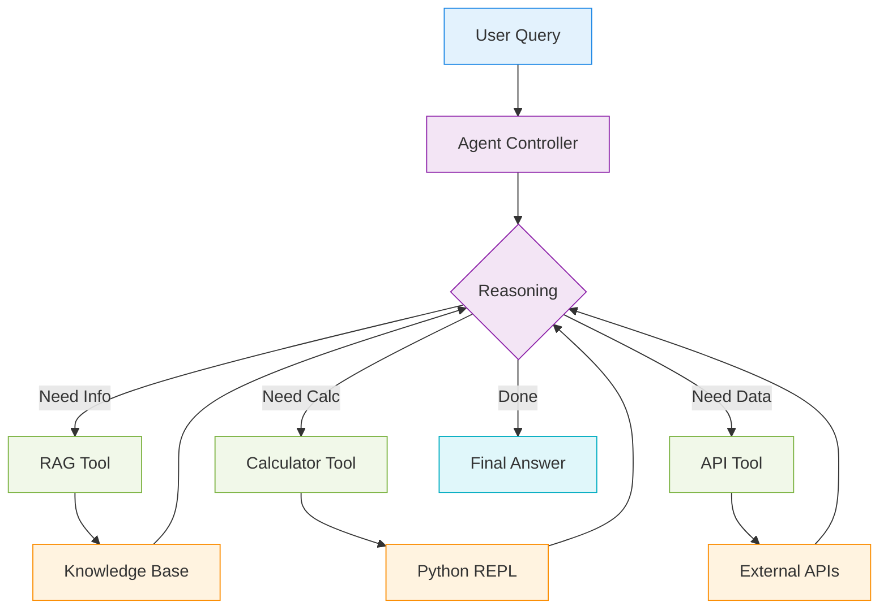

# Day 3 Portal: Orchestration, Agents & Governance

## 📋 Daily Overview

- **Duration**: 8 hours (9:00 AM - 5:00 PM)
- **Format**: 3 hours theory + demos (morning) + 3 hours labs (afternoon) + 2 hours recap
- **Learning Objectives**:
  - Understand agentic AI architecture and tool-using agents
  - Compare agent frameworks (CrewAI, LangGraph, Langflow)
  - Build agent that integrates with RAG accelerator
  - Explore watsonx Orchestrate for enterprise AI governance
- **Prerequisites**: ✅ [Day 2 RAG Complete](day2-portal.md)

---

## ☀️ Morning Session: Agentic AI & Frameworks (9:00 AM - 12:00 PM)

### Module 3.0: Agentic AI Overview (9:00 - 10:00, 60 min)

**Content**:

- 📖 [Read: Agentic AI Overview](../tracks/day3-orchestrate/agentic-ai-overview.md)
- 🎯 [Present: Agentic AI Slides (HTML)](../slides/day3-agentic-ai-overview.html)
- 📄 [Download: Agentic AI Slides (PDF)](../slides/day3-agentic-ai-overview.pdf)

**Topics Covered**:

- What are AI agents? (perception → reasoning → action)
- Agent architecture: ReAct pattern, tool calling, memory
- Agents vs. RAG: When to use each
- Multi-agent systems and collaboration patterns
- Production considerations and safety guardrails

**Instructor Notes**:

!!! tip "Key Concept: Agent = LLM + Tools + Memory"
    **LLM alone**: Can only generate text
    **Agent**: Can take actions via tools (APIs, databases, calculators)

    **Example Flow**:
    1. User: "What's the weather in Paris and book me a flight?"
    2. Agent calls `get_weather("Paris")` → 18°C, sunny
    3. Agent calls `search_flights("Paris")` → Shows options
    4. Agent asks user to confirm booking
    5. Agent calls `book_flight(flight_id)` → Confirmed

!!! warning "Agent Challenges"
    - **Reliability**: Agents can fail or get stuck in loops
    - **Cost**: Multiple LLM calls per task (expensive)
    - **Safety**: Agents can take unintended actions
    - **Debugging**: Complex to trace agent reasoning

**Suggested Pacing**:

- 0-15 min: What are agents and why do we need them?
- 15-30 min: Agent architecture (ReAct, tool calling)
- 30-45 min: Multi-agent systems
- 45-60 min: Safety and production considerations

**Agent Architecture Diagram**:



☕ **Break**: 10:00 - 10:15 (15 min)

---

### Module 3.2: Agent Frameworks Comparison (10:15 - 11:45, 90 min)

**Content**:

- 📖 [Read: CrewAI Framework](../tracks/day3-orchestrate/agentic-frameworks-crewai.md)
- 📖 [Read: LangGraph Framework](../tracks/day3-orchestrate/agentic-frameworks-langgraph.md)
- 📖 [Read: Langflow Framework](../tracks/day3-orchestrate/agentic-frameworks-langflow.md)

**Topics Covered**:

- **CrewAI**: Role-based multi-agent collaboration
- **LangGraph**: Stateful workflows with graph-based control
- **Langflow**: Visual, no-code agent builder
- Framework comparison and selection criteria

**Instructor Notes**:

!!! tip "Framework Selection Guide"
    | Framework | Best For | Complexity | Code/No-Code |
    |-----------|----------|------------|--------------|
    | **CrewAI** | Multi-agent teams, role-based tasks | Medium | Code |
    | **LangGraph** | Complex workflows, state management | High | Code |
    | **Langflow** | Rapid prototyping, non-technical users | Low | No-Code |
    | **watsonx Orchestrate** | Enterprise, governance, compliance | Medium | Low-Code |

!!! example "Live Demo: CrewAI Multi-Agent"
    **Scenario**: Research team with 3 agents

    ```python
    from crewai import Agent, Task, Crew

    # Define agents
    researcher = Agent(
        role="Researcher",
        goal="Find latest info on topic",
        tools=[search_tool, rag_tool]
    )

    writer = Agent(
        role="Writer",
        goal="Write engaging article",
        tools=[grammar_tool]
    )

    editor = Agent(
        role="Editor",
        goal="Review and polish",
        tools=[fact_check_tool]
    )

    # Define tasks
    research_task = Task(description="Research RAG architectures", agent=researcher)
    write_task = Task(description="Write blog post", agent=writer)
    edit_task = Task(description="Edit and finalize", agent=editor)

    # Create crew
    crew = Crew(agents=[researcher, writer, editor], tasks=[research_task, write_task, edit_task])
    result = crew.kickoff()
    ```

**Suggested Pacing**:

- 0-30 min: CrewAI (role-based agents)
- 30-60 min: LangGraph (stateful workflows)
- 60-75 min: Langflow (visual builder)
- 75-90 min: Comparison and Q&A

🍴 **Lunch Break**: 11:45 AM - 12:45 PM (60 min)

---

## 🔬 Afternoon Session: Hands-On Agent Labs (12:45 PM - 3:45 PM)

### Lab 3.1: Agent + RAG Accelerator Integration (12:45 - 2:15, 90 min)

**Objectives**:

- Build agent that uses RAG accelerator as a tool
- Implement tool calling for external APIs
- Add memory for multi-turn conversations
- Test agent with complex, multi-step queries

<div class="grid cards" markdown>

-   :material-robot: __Agent Core__

    ---

    ReAct pattern with watsonx Granite

    - Tool selection reasoning
    - Action execution
    - Observation processing

-   :material-tools: __Tools__

    ---

    Available agent capabilities

    - RAG tool (query knowledge base)
    - Calculator tool (math)
    - Weather API tool (example)

-   :material-memory: __Memory__

    ---

    Conversation state management

    - Short-term memory (context)
    - Long-term memory (database)
    - Memory retrieval

-   :material-api: __Integration__

    ---

    Connect to Day 2 RAG accelerator

    - API endpoint calls
    - Response parsing
    - Error handling

</div>

**Instructions**:

- 📝 [Lab 3.1: Agent + watsonx](../tracks/day3-orchestrate/lab-1-agent-watsonx.md)
- 💡 [Agent Notebooks Reference](../assets/notebooks/day3/agent_watsonx.ipynb)

**For Instructors Only**:

- ✅ Complete Solutions (in lab file)
- 🎯 Common Pitfalls and Fixes

**Success Criteria**:

- [ ] Agent successfully calls RAG tool to retrieve information
- [ ] Agent chains multiple tools for complex queries
- [ ] Memory persists across conversation turns
- [ ] Can explain agent reasoning trace (thoughts → actions → observations)

**Typical Completion Time**: 75 minutes (15 min buffer for troubleshooting)

!!! tip "Testing Prompts for Agent"
    **Simple** (1 tool call):
    ```
    "What is RAG?"
    → Agent uses RAG tool
    ```

    **Complex** (multiple tools):
    ```
    "What is RAG and how much would it cost to run 1000 queries at $0.001 per query?"
    → Agent uses RAG tool + calculator tool
    ```

    **Multi-turn** (memory):
    ```
    Turn 1: "What is RAG?"
    Turn 2: "What are the benefits?" (needs to remember context)
    ```

☕ **Break**: 2:15 - 2:30 PM (15 min)

---

### Lab 3.2: Choose Your Framework (Optional, 2:30 - 3:30, 60 min)

**Format**: Choose one framework to explore in depth or compare multiple.

**Choose One Path**:

<div class="grid cards" markdown>

-   :material-account-group: __CrewAI Multi-Agent__

    ---

    Build team of specialized agents

    - Define agent roles and goals
    - Create collaborative tasks
    - Orchestrate agent interactions

    [:octicons-arrow-right-16: Notebook](../assets/notebooks/day3/agent_crewai.ipynb)

-   :material-graph: __LangGraph Workflow__

    ---

    Build stateful agent workflow

    - Define graph nodes and edges
    - Implement conditional routing
    - Manage state transitions

    [:octicons-arrow-right-16: Notebook](../assets/notebooks/day3/agent_langgraph.ipynb)

-   :material-draw: __Langflow Visual__

    ---

    Build agent visually (no code)

    - Drag-and-drop interface
    - Connect components
    - Export to Python

    [:octicons-arrow-right-16: Documentation](../tracks/day3-orchestrate/agentic-frameworks-langflow.md)

</div>

**Instructor Note**: This lab is optional/stretch goal. If time is limited, skip and move to watsonx Orchestrate discussion.

---

## 🏢 Late Afternoon: Enterprise Orchestration & Governance (3:30 PM - 5:00 PM)

### Module 3.3: watsonx Orchestrate & Governance (3:30 - 4:15, 45 min)

**Content**:

- 📖 [Read: Bridge to Orchestrate & Governance](../tracks/day3-orchestrate/bridge-orchestrate-governance.md)
- 📖 [Read: watsonx Orchestrate Comprehensive Guide](../tracks/day3-orchestrate/watsonx-orchestrate-comprehensive.md)
- 🎯 [Present: Governance Slides (HTML)](../slides/day3-bridge-orchestrate-governance.html)

**Topics Covered**:

- **watsonx Orchestrate**: Enterprise agent platform
- **Governance**: Model monitoring, bias detection, explainability
- **Compliance**: Audit trails, access control, data lineage
- **Deployment**: Production workflows and CI/CD

**Instructor Notes**:

!!! tip "watsonx Orchestrate Value Proposition"
    **Open Source Frameworks** (CrewAI, LangGraph):
    - ✅ Flexible, free, community-driven
    - ❌ No governance, manual monitoring, DIY deployment

    **watsonx Orchestrate**:
    - ✅ Built-in governance and compliance
    - ✅ Enterprise support and SLAs
    - ✅ Integrated with watsonx.ai and watsonx.governance
    - ❌ Cost, learning curve, IBM ecosystem

    **Best Fit**: Regulated industries (finance, healthcare, government)

!!! example "Governance in Action"
    **Scenario**: Agent generates customer email

    **Without Governance**:
    - No audit trail of what agent did
    - Can't explain why certain action was taken
    - No detection of bias or toxicity

    **With watsonx.governance**:
    - Full trace: prompt → model calls → tool usage
    - Explainability: "Agent used customer history to personalize"
    - Monitoring: Alerts if bias detected
    - Compliance: Audit log for regulators

**Key Features**:

<div class="grid cards" markdown>

-   :material-shield-check: __Governance__

    ---

    - Model monitoring and drift detection
    - Bias and fairness metrics
    - Explainability (why did agent decide X?)
    - Compliance reporting

-   :material-security: __Security__

    ---

    - Role-based access control
    - Data encryption and privacy
    - Audit trails for all actions
    - Secret management

-   :material-integration: __Integration__

    ---

    - Pre-built connectors (Slack, Salesforce, SAP)
    - Custom tool creation
    - API and SDK access
    - Enterprise SSO

-   :material-scale-balance: __Scalability__

    ---

    - Multi-tenant architecture
    - Load balancing and auto-scaling
    - High availability (99.9% SLA)
    - Global deployment

</div>

---

### Module 3.6: Workshop Recap & Next Steps (4:15 - 5:00, 45 min)

**Content**:

- 📖 [Read: Recap & Next Steps](../tracks/day3-orchestrate/recap-and-next-steps.md)
- 🎯 [Present: Recap Slides (HTML)](../slides/day3-recap-and-next-steps.html)

**Discussion Topics**:

**Day 0**: Environment setup (Ollama + watsonx.ai)
- 🔗 Bridged to → Day 1

**Day 1**: LLMs and prompting
- 🔗 Bridged to → Day 2 (LLMs need data)

**Day 2**: RAG (retrieval-augmented generation)
- 🔗 Bridged to → Day 3 (RAG gives data, agents take actions)

**Day 3**: Agents and orchestration
- 🔗 Bridges to → Production (governance, deployment)

**Group Discussion Prompts**:

- "What was your biggest 'aha moment' this week?"
- "Which component would you implement first in your organization?"
- "What questions do you still have?"

**Next Steps**:

1. **Continue Learning**:
   - [IBM watsonx Documentation](https://www.ibm.com/docs/en/watsonx)
   - [LangChain Docs](https://python.langchain.com/)
   - [CrewAI Docs](https://docs.crewai.com/)

2. **Build Projects**:
   - Start with simple RAG system
   - Add agents incrementally
   - Evaluate and iterate

3. **Join Community**:
   - IBM watsonx Community
   - LangChain Discord
   - GitHub discussions

---

## 📚 Quick Reference

### All Day 3 Materials

<div class="grid cards" markdown>

-   :material-book-open-page-variant: __Theory & Slides__

    ---

    - [Agentic AI Overview](../tracks/day3-orchestrate/agentic-ai-overview.md) | [Slides](../slides/day3-agentic-ai-overview.html)
    - [Bridge to Orchestrate](../tracks/day3-orchestrate/bridge-orchestrate-governance.md) | [Slides](../slides/day3-bridge-orchestrate-governance.html)
    - [Recap & Next Steps](../tracks/day3-orchestrate/recap-and-next-steps.md) | [Slides](../slides/day3-recap-and-next-steps.html)

-   :material-flask-outline: __Labs & Notebooks__

    ---

    - [Lab 3.1: Agent + watsonx](../tracks/day3-orchestrate/lab-1-agent-watsonx.md)
    - [CrewAI Notebook](../assets/notebooks/day3/agent_crewai.ipynb)
    - [LangGraph Notebook](../assets/notebooks/day3/agent_langgraph.ipynb)
    - [watsonx Agent Notebook](../assets/notebooks/day3/agent_watsonx.ipynb)

-   :material-file-document-outline: __Framework Guides__

    ---

    - [CrewAI Framework](../tracks/day3-orchestrate/agentic-frameworks-crewai.md)
    - [LangGraph Framework](../tracks/day3-orchestrate/agentic-frameworks-langgraph.md)
    - [Langflow Framework](../tracks/day3-orchestrate/agentic-frameworks-langflow.md)

-   :material-office-building: __Enterprise Resources__

    ---

    - [watsonx Orchestrate Comprehensive](../tracks/day3-orchestrate/watsonx-orchestrate-comprehensive.md)
    - [watsonx Orchestrate Labs (Legacy)](../tracks/day3-orchestrate/watsonx-orchestrate-labs.md)

</div>

### Navigation

- [⬅️ Previous: Day 2 - RAG](day2-portal.md)
- [➡️ Next: Capstone Project](capstone-portal.md)
- [🏠 Workshop Home](../index.md)
- [📚 All Resources](../resources.md)

---

## 🎯 Learning Outcomes

By the end of Day 3, participants will be able to:

1. ✅ **Explain** agentic AI architecture and how agents differ from RAG
2. ✅ **Build** agent with tool calling and memory
3. ✅ **Compare** agent frameworks (CrewAI, LangGraph, Langflow)
4. ✅ **Integrate** agent with RAG accelerator from Day 2
5. ✅ **Understand** enterprise governance and compliance requirements
6. ✅ **Evaluate** watsonx Orchestrate for production deployments

---

## 🔧 Troubleshooting

### Common Issues During Day 3

??? question "Agent gets stuck in loop"
    **Symptoms**: Agent repeats same action multiple times

    **Causes**:
    - Tool returns unclear results
    - Agent can't determine when task is complete
    - Poor prompt engineering

    **Solution**:
    ```python
    # Add max iterations limit
    agent = Agent(
        tools=[rag_tool, calculator],
        max_iterations=5,  # Stop after 5 steps
        early_stopping_method="generate"  # Force answer
    )

    # Improve tool descriptions
    rag_tool.description = """
    Use this to search knowledge base.
    Returns: List of relevant documents.
    When to use: When you need factual information.
    When NOT to use: For calculations or opinions.
    """
    ```

??? question "Tool call fails or returns error"
    **Symptoms**: Agent crashes or returns "Tool error"

    **Diagnostic**:
    ```python
    # Test tool directly (bypass agent)
    result = rag_tool._run("What is RAG?")
    print(result)

    # Check tool input format
    print(rag_tool.args_schema)
    ```

    **Common Fixes**:
    - Verify API endpoint is running (`curl http://localhost:8001/health`)
    - Check tool function signature matches agent expectations
    - Add error handling in tool implementation

??? question "Agent doesn't use tools (generates answer directly)"
    **Symptoms**: Agent skips tools, hallucinates answer

    **Cause**: Weak system prompt or LLM too confident

    **Solution**:
    ```python
    # Strengthen system prompt
    system_message = """You are a helpful assistant with access to tools.

    IMPORTANT:
    - ALWAYS use tools to get information
    - NEVER make up answers
    - If you don't have a tool for the task, say so

    Available tools:
    - rag_tool: Search knowledge base
    - calculator: Perform calculations
    """

    # Lower temperature for more deterministic behavior
    llm = ChatWatsonx(
        model_id="ibm/granite-13b-chat-v2",
        temperature=0.1,  # Lower = more likely to follow instructions
    )
    ```

??? question "Memory not working across turns"
    **Symptoms**: Agent forgets previous conversation

    **Cause**: Memory not configured or not passed to agent

    **Solution**:
    ```python
    from langchain.memory import ConversationBufferMemory

    # Initialize memory
    memory = ConversationBufferMemory(
        memory_key="chat_history",
        return_messages=True
    )

    # Pass to agent
    agent = initialize_agent(
        tools=[rag_tool],
        llm=llm,
        memory=memory,  # Add this!
        agent=AgentType.CONVERSATIONAL_REACT_DESCRIPTION
    )

    # Test multi-turn
    print(agent.run("What is RAG?"))
    print(agent.run("What are the benefits?"))  # Should remember "RAG" from previous turn
    ```

??? question "watsonx Orchestrate access issues"
    **Symptoms**: Can't log in or deploy agent

    **Solution**:
    - Verify account has watsonx Orchestrate entitlement
    - Check IBM Cloud IAM permissions
    - Ensure project is in correct resource group
    - Contact IBM support for enterprise trial access

---

## 📊 Teaching Notes

### Recommended Pacing Adjustments

**If Running Behind** (>15 min late):

- ⏭️ Skip framework comparison, focus on one (recommend CrewAI)
- ⏭️ Demo Lab 3.1 instead of hands-on
- ⏭️ Skip Lab 3.2 (optional framework exploration)
- ⏭️ Shorten recap to 20 minutes

**If Running Ahead** (>15 min early):

- ➕ Live code an agent from scratch
- ➕ Add multi-agent collaboration demo
- ➕ Explore advanced LangGraph patterns (cycles, human-in-loop)
- ➕ Hands-on watsonx Orchestrate deployment

### Framework Selection for Labs

**For Most Students**:
- **Recommend**: Start with simple agent in Lab 3.1
- **Why**: Fundamentals apply to all frameworks

**For Advanced Students**:
- **Recommend**: Try all three frameworks and compare
- **Why**: Understand trade-offs for production decisions

---

## 📝 Daily Schedule (At-a-Glance)

```mermaid
gantt
    title Day 3: Agents & Orchestration Schedule
    dateFormat HH:mm
    axisFormat %H:%M

    section Morning Theory
    Module 3.0: Agentic AI Overview    :09:00, 60m
    Break                              :10:00, 15m
    Module 3.2: Framework Comparison   :10:15, 90m
    Lunch                              :11:45, 60m

    section Afternoon Labs
    Lab 3.1: Agent + RAG Integration   :12:45, 90m
    Break                              :14:15, 15m
    Lab 3.2: Choose Framework (opt)    :14:30, 60m

    section Enterprise & Recap
    Module 3.3: Orchestrate & Governance :15:30, 45m
    Module 3.6: Recap & Next Steps       :16:15, 45m
```

---

## 💬 Common Student Questions

### Conceptual Questions

??? question "Q: When should I use agents vs. RAG?"
    **Decision Framework**:

    | Use Case | Solution |
    |----------|----------|
    | **Answer questions from documents** | RAG |
    | **Take actions (book, send, create)** | Agent |
    | **Multi-step reasoning with tools** | Agent |
    | **Just need to retrieve info** | RAG |
    | **Need to combine both** | Agent with RAG tool |

    **Example**:
    - "What's in the product manual?" → RAG
    - "Find the manual and email it to me" → Agent (RAG tool + email tool)

??? question "Q: How do I prevent agents from taking dangerous actions?"
    **Safety Strategies**:

    1. **Human-in-the-loop**: Require approval for critical actions
    ```python
    if action == "delete_database":
        approval = input("Approve deletion? (yes/no): ")
        if approval != "yes":
            return "Action cancelled by user"
    ```

    2. **Read-only tools**: Start with safe, read-only operations
    3. **Sandboxing**: Run in isolated environment
    4. **Approval workflows**: Use watsonx Orchestrate governance
    5. **Action logging**: Audit all agent actions

??? question "Q: Can agents work with multiple LLMs?"
    **Answer**: Yes!

    **Multi-LLM Architecture**:
    ```python
    # Different LLMs for different tasks
    reasoning_llm = ChatWatsonx(model="granite-13b-chat-v2")  # Complex reasoning
    fast_llm = Ollama(model="llama2:7b")  # Quick responses

    # Route based on task complexity
    if task.complexity == "high":
        agent = Agent(llm=reasoning_llm)
    else:
        agent = Agent(llm=fast_llm)
    ```

### Technical Questions

??? question "Q: How do I debug agent reasoning?"
    **Debugging Tools**:

    ```python
    # 1. Enable verbose mode
    agent = initialize_agent(
        tools=[rag_tool],
        llm=llm,
        verbose=True  # Prints reasoning trace
    )

    # 2. Use LangSmith for tracing (optional)
    import langsmith
    langsmith.trace(agent.run("query"))

    # 3. Custom callback for logging
    from langchain.callbacks import StdOutCallbackHandler
    agent.run("query", callbacks=[StdOutCallbackHandler()])
    ```

    **What to look for**:
    - Is agent selecting correct tool?
    - Are tool inputs formatted correctly?
    - Is agent interpreting tool outputs properly?

??? question "Q: How much do agent calls cost?"
    **Cost Breakdown**:

    Typical agent query with 3 tool calls:
    1. **Initial reasoning**: 500 tokens ($0.00015)
    2. **Tool call 1**: 800 tokens ($0.00024)
    3. **Tool call 2**: 600 tokens ($0.00018)
    4. **Final answer**: 400 tokens ($0.00012)

    **Total**: ~2300 tokens ≈ **$0.0007 per query**

    **For 1000 queries**: ~$0.70 (agents) + tool costs (API, DB)

    **Optimization**:
    - Cache tool results
    - Use smaller models for simple tasks
    - Limit max iterations

---

## 📝 Homework (Optional)

For students who want to continue learning:

### Required (If Behind)

- [ ] Complete Lab 3.1 (Agent + RAG Integration)
- [ ] Test agent with complex multi-step queries
- [ ] Read: [watsonx Orchestrate Comprehensive Guide](../tracks/day3-orchestrate/watsonx-orchestrate-comprehensive.md)

### Stretch Goals

- [ ] Try all three frameworks (CrewAI, LangGraph, Langflow) and compare
- [ ] Build multi-agent system for your use case
- [ ] Add custom tools to your agent
- [ ] Implement human-in-the-loop approval workflow

### Reflection Questions

- How do agents change what's possible with LLMs?
- What safety concerns do you have about agents?
- Which framework fits your organization's needs?

---

**Last Updated**: 2025-01-13 | **Estimated Teaching Time**: 8 hours | **Success Rate**: Target 85% lab completion