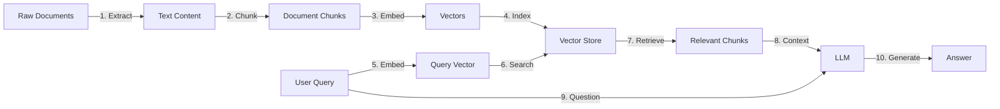

# Module 1: RAG Architecture Overview

## 📚 Learning Objectives

By the end of this module, you will be able to:
- Define Retrieval Augmented Generation and explain its value
- Identify the core components of a RAG system
- Describe the typical RAG flow from ingestion to generation
- Understand trade-offs in RAG system design
- Map RAG concepts to the AI Accelerator framework

---

## 1. What is RAG?

### Definition

**Retrieval Augmented Generation (RAG)** is a technique that enhances Large Language Models (LLMs) by providing them with relevant external knowledge retrieved from a document corpus during the generation process.

```
Traditional LLM:           RAG-Enhanced LLM:
                          
User Query                User Query
    ↓                          ↓
   LLM  →  Answer          Retriever → Relevant Docs
                                ↓
                            LLM + Context  →  Grounded Answer
```

### The Problem RAG Solves

**Challenge**: LLMs have several limitations:
1. **Knowledge Cutoff**: Training data is frozen at a point in time
2. **Hallucinations**: Models may generate plausible but incorrect information
3. **Domain Specificity**: Lack of specialized or proprietary knowledge
4. **Attribution**: Difficulty in citing sources for generated content

**Solution**: RAG addresses these by:
- Retrieving up-to-date, relevant information at query time
- Grounding responses in actual source documents
- Enabling domain-specific knowledge without retraining
- Providing source attribution for transparency

### Real-World Use Cases

1. **Customer Support Chatbots**
   - Query: "How do I reset my password?"
   - RAG retrieves: Latest help documentation
   - Response: Current, accurate reset procedure

2. **Legal Document Analysis**
   - Query: "What are precedents for contract disputes?"
   - RAG retrieves: Relevant case law and contracts
   - Response: Contextual legal analysis with citations

3. **Medical Information Systems**
   - Query: "Treatment options for condition X?"
   - RAG retrieves: Latest medical literature and guidelines
   - Response: Evidence-based treatment recommendations

4. **Enterprise Knowledge Management**
   - Query: "What's our policy on remote work?"
   - RAG retrieves: Company policy documents
   - Response: Accurate policy information with references

---

## 2. Core Components of RAG

### 2.1 Document Store / Corpus

**Purpose**: The knowledge base containing documents to be searched

**Characteristics**:
- **Format**: PDFs, HTML, markdown, plain text, structured data
- **Scale**: From hundreds to millions of documents
- **Domain**: General knowledge, domain-specific, or proprietary data

**Example**:
```python
# Document structure
document = {
    "id": "doc_12345",
    "title": "Employee Handbook 2024",
    "text": "Company policies and procedures...",
    "metadata": {
        "author": "HR Department",
        "date": "2024-01-15",
        "category": "policies"
    }
}
```

### 2.2 Chunking / Preprocessing

**Purpose**: Split large documents into manageable, semantic units

**Why Chunking Matters**:
- Embedding models have token limits (e.g., 512 tokens)
- Smaller chunks = more precise retrieval
- Balanced chunk size improves relevance

**Chunking Strategies**:

1. **Fixed-Size Chunking**
   ```python
   chunk_size = 500  # characters or tokens
   chunk_overlap = 50  # overlap for context continuity
   ```

2. **Semantic Chunking**
   - Split by paragraphs, sections, or sentences
   - Preserve natural text boundaries
   - Better semantic coherence

3. **Recursive Chunking**
   ```python
   # Try to split by:
   # 1. Double newline (paragraphs)
   # 2. Single newline (sentences)
   # 3. Spaces (words)
   # 4. Characters (last resort)
   ```

**Best Practices**:
- Include some overlap between chunks
- Preserve document metadata in each chunk
- Test different chunk sizes for your use case

### 2.3 Embeddings

**Purpose**: Convert text into dense vector representations for semantic similarity

**How Embeddings Work**:
```
Text: "The cat sat on the mat"
       ↓
Embedding Model
       ↓
Vector: [0.23, -0.45, 0.67, ..., 0.12]  # 384-1536 dimensions
```

**Popular Embedding Models**:

| Model | Dimensions | Use Case | Provider |
|-------|-----------|----------|----------|
| all-MiniLM-L6-v2 | 384 | Fast, lightweight | HuggingFace |
| all-mpnet-base-v2 | 768 | Balanced performance | HuggingFace |
| text-embedding-ada-002 | 1536 | High quality | OpenAI |
| slate-30m-english-rtrvr | 384 | Retrieval-optimized | watsonx.ai |

**Key Concepts**:
- **Semantic Similarity**: Similar meanings = similar vectors
- **Cosine Similarity**: Measures angle between vectors (0-1)
- **Dense vs Sparse**: Dense = all dimensions used; Sparse = mostly zeros

### 2.4 Vector Store

**Purpose**: Specialized database for storing and searching embeddings

**Why Not Regular Databases?**
- Traditional DBs: Exact match (WHERE clause)
- Vector DBs: Similarity search (nearest neighbors)

**Popular Vector Stores**:

1. **Chroma** - Local, lightweight
   ```python
   from langchain_chroma import Chroma
   vectorstore = Chroma.from_documents(docs, embeddings)
   ```

2. **Elasticsearch** - Enterprise, scalable
   ```python
   from langchain_elasticsearch import ElasticsearchStore
   vectorstore = ElasticsearchStore(
       elasticsearch_url=url,
       index_name="my_index"
   )
   ```

3. **FAISS** - High-performance, in-memory
   ```python
   from langchain_community.vectorstores import FAISS
   vectorstore = FAISS.from_documents(docs, embeddings)
   ```

**Vector Store Operations**:
```python
# Add documents
vectorstore.add_documents(documents)

# Similarity search
results = vectorstore.similarity_search(
    query="What is the refund policy?",
    k=5  # return top 5 results
)

# Similarity search with scores
results = vectorstore.similarity_search_with_score(
    query="What is the refund policy?",
    k=5
)
```

### 2.5 Retriever

**Purpose**: Interface to query the vector store and return relevant documents

**Retrieval Strategies**:

1. **Similarity Search**
   ```python
   retriever = vectorstore.as_retriever(
       search_type="similarity",
       search_kwargs={"k": 4}
   )
   ```

2. **MMR (Maximum Marginal Relevance)**
   - Balances relevance and diversity
   - Avoids redundant results
   ```python
   retriever = vectorstore.as_retriever(
       search_type="mmr",
       search_kwargs={"k": 4, "fetch_k": 20}
   )
   ```

3. **Similarity with Threshold**
   ```python
   retriever = vectorstore.as_retriever(
       search_type="similarity_score_threshold",
       search_kwargs={"score_threshold": 0.7, "k": 4}
   )
   ```

### 2.6 LLM + Prompt

**Purpose**: Generate answers using retrieved context

**Prompt Pattern**:
```python
prompt_template = """
Use the following context to answer the question.
If you don't know the answer, say you don't know.

Context: {context}

Question: {question}

Answer:
"""
```

**LLM Options**:
- **Local**: Ollama (llama2, mistral)
- **Cloud**: watsonx.ai (Granite), OpenAI (GPT), Anthropic (Claude)

---

## 3. Typical RAG Flow

### Complete RAG Pipeline



### Phase 1: Ingestion (One-Time Setup)

**Step 1: Extract**
```python
# Extract text from various formats
from langchain.document_loaders import (
    PyPDFLoader,
    TextLoader,
    UnstructuredHTMLLoader
)

loader = PyPDFLoader("employee_handbook.pdf")
documents = loader.load()
```

**Step 2: Chunk**
```python
from langchain.text_splitters import RecursiveCharacterTextSplitter

splitter = RecursiveCharacterTextSplitter(
    chunk_size=1000,
    chunk_overlap=200
)
chunks = splitter.split_documents(documents)
```

### Phase 2: Indexing (One-Time Setup)

**Step 3: Embed**
```python
from langchain_community.embeddings import HuggingFaceEmbeddings

embeddings = HuggingFaceEmbeddings(
    model_name="all-MiniLM-L6-v2"
)
```

**Step 4: Index**
```python
from langchain_chroma import Chroma

vectorstore = Chroma.from_documents(
    documents=chunks,
    embedding=embeddings,
    persist_directory="./chroma_db"
)
```

### Phase 3: Retrieval (Per Query)

**Step 5-7: Query & Retrieve**
```python
# User asks a question
query = "What is the vacation policy?"

# Retrieve relevant chunks
retriever = vectorstore.as_retriever(k=4)
relevant_docs = retriever.get_relevant_documents(query)

# Each doc contains:
# - page_content: The text chunk
# - metadata: Document info
```

### Phase 4: Generation (Per Query)

**Step 8-10: Generate Answer**
```python
from langchain.chains import RetrievalQA
from langchain_community.llms import Ollama

llm = Ollama(model="llama2")

qa_chain = RetrievalQA.from_chain_type(
    llm=llm,
    retriever=retriever,
    return_source_documents=True
)

result = qa_chain({"query": query})
print(result['result'])  # Answer
print(result['source_documents'])  # Sources
```

---

## 4. Trade-Offs in RAG Design

### 4.1 Latency vs Accuracy

**Latency Factors**:
- Embedding model size
- Vector store query time
- Number of retrieved chunks (k)
- LLM size and parameters

**Optimization Strategies**:
```python
# Faster (lower latency)
embeddings = HuggingFaceEmbeddings("all-MiniLM-L6-v2")  # 384 dim
k = 3  # fewer chunks
llm = Ollama("llama2:7b")  # smaller model

# More accurate (higher latency)
embeddings = HuggingFaceEmbeddings("all-mpnet-base-v2")  # 768 dim
k = 10  # more chunks
llm = WatsonxLLM("ibm/granite-13b-chat-v2")  # larger model
```

### 4.2 Embedding Model Selection

**Considerations**:
- **Domain**: General vs specialized (legal, medical, etc.)
- **Language**: Multilingual support
- **Dimensions**: Higher = more nuance, slower
- **License**: Open-source vs proprietary

**Comparison**:
| Criteria | Small Model | Large Model |
|----------|-------------|-------------|
| Speed | ⚡⚡⚡ | ⚡ |
| Accuracy | ⭐⭐ | ⭐⭐⭐ |
| Memory | 💾 | 💾💾💾 |
| Cost | $ | $$$ |

### 4.3 Index Size and Refresh

**Index Size Trade-offs**:
- **Large Index**: 
  - ✅ More comprehensive knowledge
  - ❌ Slower queries, more storage
  
- **Small Index**:
  - ✅ Faster queries, less storage
  - ❌ May miss relevant information

**Refresh Strategies**:

1. **Batch Refresh** (Daily/Weekly)
   ```python
   # Full reindex
   vectorstore.delete_collection()
   vectorstore = Chroma.from_documents(new_docs, embeddings)
   ```

2. **Incremental Updates**
   ```python
   # Add new documents
   vectorstore.add_documents(new_docs)
   
   # Update existing
   vectorstore.delete(ids=["doc_123"])
   vectorstore.add_documents([updated_doc])
   ```

3. **Hot/Cold Separation**
   - Frequently accessed: In-memory, fast index
   - Archival: Disk-based, slower but comprehensive

---

## 5. RAG in the AI Accelerator

### Accelerator Architecture

The AI Accelerator provides production-ready RAG components:

```
accelerator/
├── tools/
│   ├── chunk.py          # Document chunking
│   ├── extract.py        # Text extraction
│   └── embed_index.py    # Embedding & indexing
├── rag/
│   ├── retriever.py      # Retrieval logic
│   ├── pipeline.py       # End-to-end RAG
│   └── prompt.py         # Prompt templates
└── service/
    └── api.py            # FastAPI endpoints
```

### Component Details

#### 1. Ingestion & Indexing

**`tools/chunk.py`** - Document Chunking
```python
def chunk_documents(
    documents: List[Document],
    chunk_size: int = 1000,
    chunk_overlap: int = 200
) -> List[Document]:
    """Split documents into chunks"""
    pass
```

**`tools/extract.py`** - Text Extraction
```python
def extract_text(
    file_path: str,
    file_type: str
) -> str:
    """Extract text from PDF, HTML, etc."""
    pass
```

**`tools/embed_index.py`** - Embedding & Indexing
```python
def embed_and_index(
    chunks: List[Document],
    vector_store_config: dict
) -> VectorStore:
    """Embed chunks and store in vector DB"""
    pass
```

#### 2. Retrieval & Generation

**`rag/retriever.py`** - Retrieval Function
```python
def retrieve(
    query: str,
    vectorstore: VectorStore,
    k: int = 5
) -> List[Document]:
    """Retrieve relevant documents"""
    pass
```

**`rag/pipeline.py`** - RAG Pipeline
```python
def answer_question(
    query: str,
    retriever: Retriever,
    llm: BaseLLM
) -> dict:
    """
    Returns:
        {
            "answer": str,
            "chunks": List[dict],
            "metadata": dict
        }
    """
    pass
```

**`rag/prompt.py`** - Prompt Templates
```python
SYSTEM_PROMPT = """
You are a helpful assistant that answers questions
based on the provided context.
"""

USER_TEMPLATE = """
Context: {context}

Question: {question}

Answer:
"""
```

### Reference Notebooks

Located in `accelerator/assets/notebook/`:

1. **`Process_and_Ingest_Data_into_Vector_DB.ipynb`**
   - Complete ingestion pipeline
   - Multiple data sources
   - Error handling

2. **`QnA_with_RAG.ipynb`**
   - Query answering examples
   - Different retrieval strategies
   - Response formatting

3. **`Test_Queries_for_Vector_DB.ipynb`**
   - Testing retrieval quality
   - Performance benchmarks
   - Query debugging

---

## 6. How Day 2 Labs Map to RAG Components

### Lab Progression

```
Lab 2.1 (Local RAG)
    ↓
Learn: Basic RAG flow, Ollama integration, Chroma usage
Maps to: chunk.py, embed_index.py basics

Lab 2.2 (watsonx RAG)
    ↓
Learn: Enterprise RAG, Elasticsearch, watsonx.ai
Maps to: retriever.py, pipeline.py

Lab 2.3 (Twin Pipelines)
    ↓
Learn: Multi-backend orchestration, comparison
Maps to: Service layer design, api.py

Lab 2.4 (Evaluation)
    ↓
Learn: Metrics, testing, optimization
Maps to: tools/eval_small.py, monitoring
```

### Progressive Implementation

Each lab builds toward a production RAG service:

1. **Lab 2.1**: Core concepts in notebook
2. **Lab 2.2**: Enterprise patterns
3. **Lab 2.3**: Service design
4. **Lab 2.4**: Quality assurance

By end of Day 2:
- ✅ Understand all RAG components
- ✅ Implement multiple RAG backends
- ✅ Ready to integrate into accelerator
- ✅ Evaluate and optimize RAG systems

---

## Summary

### Key Takeaways

1. **RAG = Retrieval + Generation**
   - Grounds LLM responses in external knowledge
   - Reduces hallucinations through factual context

2. **Core Pipeline**: Ingest → Index → Retrieve → Generate

3. **Critical Components**:
   - Chunking strategy
   - Embedding model
   - Vector store
   - Retrieval mechanism
   - LLM integration

4. **Trade-offs Matter**:
   - Latency vs accuracy
   - Index size vs freshness
   - Cost vs performance

5. **Production-Ready**:
   - Use accelerator patterns
   - Implement evaluation
   - Monitor and iterate

### Next Steps

1. Review this theory document
2. Explore reference notebooks
3. Begin Lab 2.1: Local RAG implementation
4. Map your learning to accelerator architecture

---

## Additional Resources

### Documentation
- [LangChain RAG Guide](https://python.langchain.com/docs/use_cases/question_answering/)
- [watsonx.ai RAG Patterns](https://www.ibm.com/docs/en/watsonx-as-a-service)
- [Vector Database Comparison](https://benchmark.vectorview.ai/)

### Papers
- "Retrieval-Augmented Generation for Knowledge-Intensive NLP Tasks"
- "Dense Passage Retrieval for Open-Domain Question Answering"

### Tools
- [LangSmith](https://smith.langchain.com/) - RAG debugging
- [Weights & Biases](https://wandb.ai/) - Experiment tracking

---

**Theory Module Complete!** ✅

Proceed to Lab 2.1 when ready.
