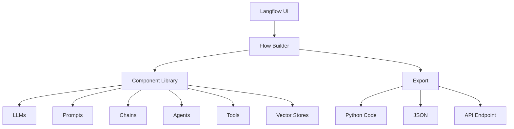

# 🎨 Langflow: Visual Agent Workflow Builder {data-background-color="#581c87"}

::: notes
This section covers Langflow, a visual tool for building LangChain-based AI applications without extensive coding. Perfect for experimentation, teaching, and rapid prototyping.
:::

---

## 🎯 What is Langflow? {data-transition="slide"}

<span class="fragment">**Langflow** is a **visual, low-code** platform for building LangChain applications</span>

<span class="fragment">**Drag-and-drop** interface for AI workflows</span>

<span class="fragment">No coding required (but export to code available!)</span>

::: notes
Langflow makes LangChain accessible through a visual interface, perfect for experimentation and teaching.
:::

---

## Core Philosophy {data-transition="fade"}

<span class="fragment">**Visual representation** of complex agent logic</span>

<span class="fragment">**Rapid prototyping** for both developers and non-developers</span>

<span class="fragment">**Export to code** for production deployment</span>

<span class="fragment">Bridge the gap between **visual design** and **code implementation**</span>

::: notes
Langflow democratizes agent building - you don't need to be a Python expert to create sophisticated workflows.
:::

---

## 🤔 Why Langflow? {data-background-color="#1e3a8a"}

### Challenges with Code-First Approaches

<span class="fragment">**Steep learning curve** for non-developers</span>

<span class="fragment">**Hard to visualize** complex workflows</span>

<span class="fragment">**Slow iteration** for experimentation</span>

::: notes
Traditional code-first approaches have barriers that Langflow removes.
:::

---

## Langflow Solutions {data-transition="zoom"}

<span class="fragment">**Visual Interface** - See your workflow as you build</span>

<span class="fragment">**Component Library** - Pre-built LangChain components</span>

<span class="fragment">**Live Testing** - Test flows immediately</span>

<span class="fragment">**Export Options** - Python code, JSON, or API</span>

<span class="fragment">**Collaboration** - Share flows with team members</span>

::: notes
Langflow bridges the gap between visual design and code implementation.
:::

---

## 🏗️ Langflow Architecture {data-background-color="#064e3b"}



::: notes
Langflow provides a complete ecosystem for visual AI workflow development.
:::

---

## 🧩 Langflow Core Components {data-transition="slide"}

### LLMs

<span class="fragment">OpenAI, Anthropic, HuggingFace, Ollama, **Watsonx.ai**</span>

### Prompts

<span class="fragment">Prompt templates, few-shot examples, system messages</span>

<span class="fragment">Variable substitution</span>

::: notes
Langflow supports all major LLM providers and prompt engineering patterns.
:::

---

## Chains {data-transition="fade"}

Pre-built LangChain patterns:

<span class="fragment">**LLMChain** - Simple LLM + prompt</span>

<span class="fragment">**Sequential Chain** - Multiple steps</span>

<span class="fragment">**Router Chain** - Conditional routing</span>

<span class="fragment">**RAG Chain** - Retrieval-augmented generation</span>

::: notes
Chains compose components into reusable patterns.
:::

---

## Agents {data-transition="slide"}

Agent types available:

<span class="fragment">**Zero-shot ReAct** - Reasoning and acting</span>

<span class="fragment">**Conversational** - Multi-turn conversations</span>

<span class="fragment">**OpenAI Functions** - Function calling</span>

<span class="fragment">**Custom agents** - Your own logic</span>

::: notes
Agents add reasoning and tool-use capabilities to your workflows.
:::

---

## Tools {data-transition="fade"}

Built-in tools:

<span class="fragment">**Search** - Google, Bing, DuckDuckGo</span>

<span class="fragment">**Calculator** - Math operations</span>

<span class="fragment">**Python REPL** - Code execution</span>

<span class="fragment">**API calls** - Custom integrations</span>

<span class="fragment">**Custom Python tools** - Your own functions</span>

::: notes
Tools extend agent capabilities beyond just LLM knowledge.
:::

---

## Memory & Vector Stores {data-background-color="#1e3a8a"}

### Memory Types

<span class="fragment">**Buffer memory** - Recent messages</span>

<span class="fragment">**Summary memory** - Condensed history</span>

<span class="fragment">**Vector store memory** - Semantic search</span>

### Vector Databases

<span class="fragment">Chroma, Pinecone, Weaviate, Milvus, Qdrant</span>

::: notes
Memory enables multi-turn conversations. Vector stores enable RAG.
:::

---

## Document Loaders {data-transition="slide"}

Load data from:

<span class="fragment">**PDF** - Document files</span>

<span class="fragment">**CSV** - Tabular data</span>

<span class="fragment">**Web pages** - URLs</span>

<span class="fragment">**APIs** - External services</span>

<span class="fragment">**Databases** - SQL/NoSQL</span>

::: notes
Document loaders make it easy to ingest data from various sources.
:::

---

## 🚀 Getting Started with Langflow {data-background-color="#064e3b"}

### Installation

```bash
# Install Langflow
pip install langflow

# Run Langflow
langflow run
```

<span class="fragment">**Access the UI:** `http://localhost:7860`</span>

### Docker Alternative

```bash
docker run -p 7860:7860 langflowai/langflow
```

::: notes
Langflow is easy to install and run locally or in containers.
:::

---

## 🎨 Building Your First Flow {data-transition="slide"}

### Example: Simple Q&A Bot

**Components Needed:**

<span class="fragment">1. **Chat Input** - User questions</span>

<span class="fragment">2. **Prompt Template** - Format the prompt</span>

<span class="fragment">3. **OpenAI LLM** - Generate responses</span>

<span class="fragment">4. **Chat Output** - Display results</span>

::: notes
Let's walk through creating a basic chatbot flow step by step.
:::

---

## Step 1: Add Components {data-transition="fade"}

<span class="fragment">1. Drag **Chat Input** to canvas</span>

<span class="fragment">2. Drag **Prompt Template** to canvas</span>

<span class="fragment">3. Drag **OpenAI** to canvas</span>

<span class="fragment">4. Drag **Chat Output** to canvas</span>

::: notes
The visual interface makes it easy to see all the pieces of your workflow.
:::

---

## Step 2: Configure Prompt {data-transition="slide"}

```
You are a helpful assistant.

User question: {question}

Provide a clear, concise answer.
```

<span class="fragment">Use `{question}` as a **variable** placeholder</span>

<span class="fragment">This will be filled from the Chat Input</span>

::: notes
The prompt template defines how the LLM should respond.
:::

---

## Step 3: Connect Components {data-transition="fade"}

<span class="fragment">1. Connect **Chat Input** → **Prompt Template** (question)</span>

<span class="fragment">2. Connect **Prompt Template** → **OpenAI** (prompt)</span>

<span class="fragment">3. Connect **OpenAI** → **Chat Output** (response)</span>

<span class="fragment">Connections define **data flow**</span>

::: notes
Connections are intuitive - just drag from one component's output to another's input.
:::

---

## Step 4: Test {data-transition="slide"}

<span class="fragment">1. Click **Run** button</span>

<span class="fragment">2. Enter question in chat input</span>

<span class="fragment">3. See response from LLM</span>

<span class="fragment">**Iterate** and refine immediately!</span>

::: notes
Instant testing is one of Langflow's biggest advantages.
:::

---

## 📚 Building a RAG Flow {data-background-color="#7c2d12"}

### Two Phases

**Data Ingestion:**

<span class="fragment">1. Document Loader → 2. Text Splitter → 3. Embedding Model → 4. Vector Store</span>

**Query Pipeline:**

<span class="fragment">1. Question Input → 2. Vector Store Retriever → 3. Prompt + Context → 4. LLM → 5. Output</span>

::: notes
RAG requires two phases: ingestion (process documents) and querying (answer questions).
:::

---

## RAG Flow: Data Ingestion {data-transition="slide"}

### Step 1: File Loader

<span class="fragment">Upload **PDFs or text files**</span>

<span class="fragment">Configure file path</span>

### Step 2: Text Splitter

<span class="fragment">Choose: **RecursiveCharacterTextSplitter**</span>

<span class="fragment">Set `chunk_size`: **1000**</span>

<span class="fragment">Set `chunk_overlap`: **200**</span>

::: notes
The text splitter breaks documents into manageable chunks for embedding.
:::

---

## Ingestion (Continued) {data-transition="fade"}

### Step 3: Embedding Model

<span class="fragment">**OpenAI Embeddings** or **HuggingFace Embeddings**</span>

<span class="fragment">Converts text to vectors</span>

### Step 4: Vector Store

<span class="fragment">Choose: **Chroma** (or Pinecone, Weaviate, etc.)</span>

<span class="fragment">Connect documents and embeddings</span>

<span class="fragment">Stores vectors for retrieval</span>

::: notes
The vector store enables semantic search over your documents.
:::

---

## RAG Flow: Query Pipeline {data-transition="slide"}

### Step 1: Chat Input

<span class="fragment">User enters a question</span>

### Step 2: Vector Store Retriever

<span class="fragment">Use the **same vector store** from ingestion</span>

<span class="fragment">Set `k=5` (retrieve top 5 chunks)</span>

::: notes
The retriever searches the vector store for relevant chunks.
:::

---

## Query Pipeline (Continued) {data-transition="fade"}

### Step 3: Prompt Template

```
Context: {context}

Question: {question}

Answer based on the context above:
```

<span class="fragment">Combines retrieved context with user question</span>

### Step 4: LLM → Chat Output

<span class="fragment">Generate answer and display</span>

::: notes
The LLM uses the retrieved context to generate accurate answers.
:::

---

## RAG Flow: Connections {data-transition="slide"}

**Ingestion:**

<span class="fragment">File → Text Splitter → Embeddings → Vector Store</span>

**Query:**

<span class="fragment">Chat Input → Vector Store (query)</span>

<span class="fragment">Vector Store (results) → Prompt Template (context)</span>

<span class="fragment">Chat Input → Prompt Template (question)</span>

<span class="fragment">Prompt Template → LLM → Chat Output</span>

::: notes
Proper connections ensure data flows correctly through the pipeline.
:::

---

## 🤖 Agent Flow with Tools {data-background-color="#1e3a8a"}

### Create a Tool-Using Agent

**Components:**

<span class="fragment">1. **Chat Input** - User questions</span>

<span class="fragment">2. **Agent** (Zero-shot ReAct) - Decision maker</span>

<span class="fragment">3. **Tools** - Calculator, Search</span>

<span class="fragment">4. **LLM** - Powers the agent</span>

<span class="fragment">5. **Chat Output** - Display results</span>

::: notes
Agents can decide which tools to use based on the user's question.
:::

---

## Agent Flow: Add Tools {data-transition="slide"}

### Calculator Tool

<span class="fragment">Drag **Calculator** component</span>

<span class="fragment">No configuration needed</span>

### Search Tool

<span class="fragment">Drag **Search** component</span>

<span class="fragment">Choose provider: **DuckDuckGo**</span>

<span class="fragment">Add API key if required</span>

::: notes
Tools extend the agent's capabilities beyond just LLM knowledge.
:::

---

## Agent Flow: Configure Agent {data-transition="fade"}

### Agent Settings

<span class="fragment">Type: **Zero-shot ReAct Description**</span>

<span class="fragment">Connect **LLM** (OpenAI GPT-4)</span>

<span class="fragment">Connect **Tools** (Calculator, Search)</span>

### Agent Prompt

```
You are a helpful assistant with access to tools.

Use the calculator for math problems.
Use search for current information.

Explain your reasoning step-by-step.
```

::: notes
The agent will use ReAct pattern: Reason, Act, Observe.
:::

---

## Agent Flow: Test {data-transition="slide"}

**Connect and Test:**

<span class="fragment">Chat Input → Agent → Chat Output</span>

**Test Questions:**

<span class="fragment">1. "What is 127 * 49?" (uses **calculator**)</span>

<span class="fragment">2. "Who won the latest Nobel Prize in Physics?" (uses **search**)</span>

<span class="fragment">3. "Calculate 25% of $450 and search for investment tips" (uses **both**)</span>

::: notes
The agent will automatically choose the right tool based on the question. This is the power of agentic AI!
:::

---

## 🔗 Custom API Integration {data-background-color="#064e3b"}

### Connect to Your RAG Service

Use **API Request Component**:

<span class="fragment">1. Drag **API Request** to canvas</span>

<span class="fragment">2. Configure URL: `http://localhost:8000/ask`</span>

<span class="fragment">3. Method: **POST**</span>

<span class="fragment">4. Headers: `{"Content-Type": "application/json"}`</span>

<span class="fragment">5. Body: `{"question": "{question}"}`</span>

::: notes
Langflow can call any HTTP API, including your RAG accelerator from Day 2!
:::

---

## Custom Python Tool {data-transition="slide"}

### Python Tool Component

```python {data-line-numbers="1-2|4-14|16-19"}
from langchain.tools import Tool

def rag_search(question: str) -> str:
    """Search the knowledge base"""
    import requests

    response = requests.post(
        "http://localhost:8000/ask",
        json={"question": question}
    )
    data = response.json()

    return f"Answer: {data['answer']}\n" \
           f"Sources: {data.get('citations', [])}"

# Tool will be automatically created
```

::: notes
Custom Python tools give you full flexibility to integrate any service.
:::

---

## ✅ Langflow Best Practices {data-transition="fade"}

### 1. Organization

<span class="fragment">**Group** related components</span>

<span class="fragment">Use **clear naming** conventions</span>

<span class="fragment">Add **comments** to complex flows</span>

<span class="fragment">Create **reusable sub-flows**</span>

::: notes
Good organization makes flows easier to understand and maintain.
:::

---

## Best Practices (Continued) {data-transition="slide"}

### 2. Testing

<span class="fragment">Test each component **individually**</span>

<span class="fragment">Validate **connections**</span>

<span class="fragment">Use **sample inputs**</span>

<span class="fragment">Check **error handling**</span>

### 3. Performance

<span class="fragment">**Cache embeddings** when possible</span>

<span class="fragment">**Limit retrieval** results (k parameter)</span>

<span class="fragment">Use appropriate **chunk sizes**</span>

::: notes
Testing and performance optimization are crucial for production deployments.
:::

---

## Best Practices (Continued) {data-transition="fade"}

### 4. Security

<span class="fragment">Never **hardcode API keys**</span>

<span class="fragment">Use **environment variables**</span>

<span class="fragment">**Validate** user inputs</span>

<span class="fragment">**Sanitize** outputs</span>

::: notes
Security is critical, especially when deploying to production.
:::

---

## 📤 Export and Deployment {data-background-color="#1e3a8a"}

### Export Options

<span class="fragment">**1. Python Code** - Export as Python script for your applications</span>

<span class="fragment">**2. JSON** - Export flow configuration to share or import later</span>

<span class="fragment">**3. API Endpoint** - Langflow creates a REST API automatically</span>

::: notes
Langflow flows can be deployed in multiple ways, from code to APIs.
:::

---

## Langflow API Usage {data-transition="slide"}

### Call Flow via API

Get Flow ID from Langflow UI, then:

```python
import requests

response = requests.post(
    "http://localhost:7860/api/v1/run/{flow_id}",
    json={
        "inputs": {"question": "What is RAG?"},
        "tweaks": {}
    }
)

result = response.json()
print(result)
```

::: notes
The API allows you to integrate Langflow flows into any application.
:::

---

## 🧪 Lab Exercise: RAG + Agent Flow {data-background-color="#581c87"}

### Objective

Build a complete application that combines RAG and agent capabilities

### Part 1: RAG Pipeline

<span class="fragment">1. Load documents (use sample PDFs)</span>

<span class="fragment">2. Create vector store</span>

<span class="fragment">3. Build retrieval chain</span>

::: notes
This exercise combines everything you've learned about Langflow.
:::

---

## Lab Exercise (Continued) {data-transition="slide"}

### Part 2: Agent Layer

<span class="fragment">1. Create agent with **two tools**:</span>

<span class="fragment">   - RAG search tool (from Part 1)</span>

<span class="fragment">   - Calculator tool</span>

<span class="fragment">2. Test with **mixed questions**</span>

::: notes
The agent should intelligently decide when to use each tool.
:::

---

## Lab Test Scenarios {data-transition="fade"}

<span class="fragment">**Scenario 1: Pure RAG** - "What is the company's refund policy?"</span>

<span class="fragment">**Scenario 2: Pure Calculation** - "Calculate 15% discount on $299.99"</span>

<span class="fragment">**Scenario 3: Mixed** - "What's the return window and calculate the refund for a $150 item with 10% restocking fee"</span>

::: notes
The agent should intelligently use both tools to answer the mixed question.
:::

---

## 🔄 Advanced: Multi-Agent Workflows {data-background-color="#064e3b"}

### Supervisor Pattern

**Components:**

<span class="fragment">1. **Supervisor Agent** - Coordinates</span>

<span class="fragment">2. **Specialist Agent 1** - Research</span>

<span class="fragment">3. **Specialist Agent 2** - Calculation</span>

<span class="fragment">4. **Specialist Agent 3** - Writing</span>

::: notes
Multi-agent patterns are possible in Langflow but require careful flow design.
:::

---

## Supervisor Flow {data-transition="slide"}

**Flow:**

<span class="fragment">User question → **Supervisor**</span>

<span class="fragment">Supervisor → Routes to **specialist(s)**</span>

<span class="fragment">Specialist(s) → Returns to **supervisor**</span>

<span class="fragment">Supervisor → Synthesizes **final answer**</span>

::: notes
This pattern enables sophisticated multi-agent coordination.
:::

---

## 🆚 Langflow vs Code-First {data-background-color="#1e3a8a"}

### When to Use Langflow

<span class="fragment">**Rapid prototyping** and experimentation</span>

<span class="fragment">**Teaching** and demonstrations</span>

<span class="fragment">**Non-developer** participation</span>

<span class="fragment">**Visual workflow** documentation</span>

<span class="fragment">**Quick iterations** on prompts/chains</span>

::: notes
Langflow excels at certain use cases.
:::

---

## When to Use Code (LangChain/LangGraph) {data-transition="fade"}

<span class="fragment">**Complex state management**</span>

<span class="fragment">**Advanced control flow**</span>

<span class="fragment">**Unit testing** and CI/CD</span>

<span class="fragment">**Custom components**</span>

<span class="fragment">**Production applications** at scale</span>

::: notes
Code-first is better for complex production systems. Often both approaches are used together.
:::

---

## 🔌 Integration with Other Tools {data-background-color="#064e3b"}

### Langflow + LangSmith

<span class="fragment">**Trace** flow executions</span>

<span class="fragment">**Debug** issues</span>

<span class="fragment">**Monitor** performance</span>

<span class="fragment">**Analyze** costs</span>

### Langflow + LangServe

<span class="fragment">**Deploy** flows as production APIs</span>

<span class="fragment">**Auto-generated** OpenAPI docs</span>

::: notes
Langflow integrates well with the broader LangChain ecosystem.
:::

---

## 🌍 Real-World Use Cases {data-transition="slide"}

### 1. Customer Support Bot

<span class="fragment">RAG over knowledge base</span>

<span class="fragment">Multi-language support</span>

<span class="fragment">Escalation routing</span>

### 2. Research Assistant

<span class="fragment">Multi-source document search</span>

<span class="fragment">Summarization</span>

<span class="fragment">Citation tracking</span>

::: notes
These use cases demonstrate Langflow's versatility across domains.
:::

---

## Use Cases (Continued) {data-transition="fade"}

### 3. Data Analysis Helper

<span class="fragment">Natural language to SQL</span>

<span class="fragment">Chart generation</span>

<span class="fragment">Report creation</span>

::: notes
Langflow can power sophisticated business applications.
:::

---

## 📚 Langflow Resources {data-background-color="#1e3a8a"}

### Documentation & Community

<span class="fragment">[Langflow Docs](https://docs.langflow.org/)</span>

<span class="fragment">[GitHub Repository](https://github.com/logspace-ai/langflow)</span>

<span class="fragment">Discord community</span>

<span class="fragment">Example flows repository</span>

### Installation

```bash
pip install langflow
langflow run
```

::: notes
Active community and good documentation make learning Langflow easier.
:::

---

## 🎯 Summary: Langflow {data-background-color="#581c87"}

### Key Takeaways

<span class="fragment">**Visual interface** for building LangChain applications</span>

<span class="fragment">**Drag-and-drop** components for LLMs, agents, tools</span>

<span class="fragment">**RAG pipelines** easily constructed</span>

<span class="fragment">**Export options**: Python, JSON, API</span>

<span class="fragment">Great for **prototyping** and **collaboration**</span>

---

## Navigation & Next Steps {data-background-color="#0f172a"}

### 🏠 Workshop Portal

**[Workshop Home](https://ruslanmv.com/watsonx-workshop/portal/)** | **[Day 3 Overview](../../portal/day3-portal.md)**

### Related Content

<span class="fragment">← [Agentic AI Overview](./agentic-ai-overview.md)</span>
<span class="fragment">← [CrewAI Framework](./agentic-frameworks-crewai.md)</span>
<span class="fragment">→ [LangGraph Framework](./agentic-frameworks-langgraph.md)</span>
<span class="fragment">→ [watsonx Orchestrate](./bridge-orchestrate-governance.md)</span>

**Version:** 1.0 | **Updated:** January 2025

::: notes
Langflow provides an accessible entry point to agent development. Next, explore LangGraph for more control!
:::