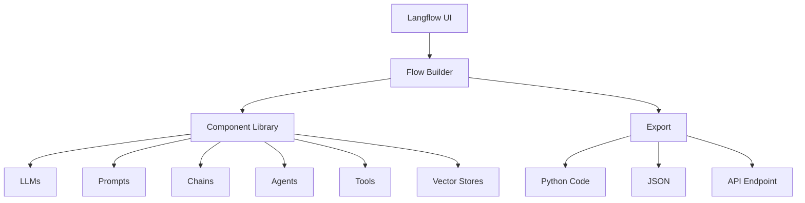

# Langflow: Visual Agent Workflow Builder {data-background-color="#581c87"}

::: notes
This section covers Langflow, a visual tool for building LangChain-based AI applications without extensive coding.
:::

---

## What is Langflow? {data-transition="slide"}

<div class="fragment">

**Langflow** is a **visual, low-code** platform for building LangChain applications.

</div>

<div class="fragment">

### Core Philosophy

- **Drag-and-drop** interface for building AI workflows
- **Visual representation** of complex agent logic
- **Export to code** for production deployment
- **Rapid prototyping** for both developers and non-developers

</div>

::: notes
Langflow makes LangChain accessible through a visual interface, perfect for experimentation and teaching.
:::

---

## Why Langflow? {data-transition="fade"}

### Challenges with Code-First Approaches

<div class="fragment">

- Steep learning curve for non-developers
- Hard to visualize complex workflows
- Slow iteration for experimentation

</div>

<div class="fragment">

### Langflow Solutions

- **Visual Interface**: See your workflow as you build
- **Component Library**: Pre-built LangChain components
- **Live Testing**: Test flows immediately
- **Export Options**: Python code, JSON, or API
- **Collaboration**: Share flows with team members

</div>

::: notes
Langflow bridges the gap between visual design and code implementation.
:::

---

## Langflow Architecture {data-background-color="#1e3a8a"}



::: notes
Langflow provides a complete ecosystem for visual AI workflow development.
:::

---

## Langflow Core Components {data-transition="slide"}

### LLMs

<div class="fragment">

Language model providers:
- OpenAI
- Anthropic
- HuggingFace
- Ollama
- Watsonx.ai

</div>

### Prompts

<div class="fragment">

- Prompt templates
- Few-shot examples
- System messages
- Variable substitution

</div>

::: notes
Langflow supports all major LLM providers and prompt engineering patterns.
:::

---

## Langflow Core Components (Continued) {data-transition="fade"}

### Chains

<div class="fragment">

Pre-built LangChain patterns:
- LLMChain
- Sequential Chain
- Router Chain
- RAG Chain

</div>

### Agents

<div class="fragment">

Agent types:
- Zero-shot ReAct
- Conversational
- OpenAI Functions
- Custom agents

</div>

::: notes
Chains compose components, agents add reasoning and tool-use capabilities.
:::

---

## Langflow Core Components (Continued) {data-transition="fade"}

### Tools

<div class="fragment">

Built-in tools:
- Search (Google, Bing, DuckDuckGo)
- Calculator
- Python REPL
- API calls
- Custom Python tools

</div>

### Memory

<div class="fragment">

Conversation memory types:
- Buffer memory
- Summary memory
- Vector store memory

</div>

::: notes
Tools extend agent capabilities, memory enables multi-turn conversations.
:::

---

## Langflow Core Components (Continued) {data-transition="fade"}

### Vector Stores

<div class="fragment">

Supported vector databases:
- Chroma
- Pinecone
- Weaviate
- Milvus
- Qdrant

</div>

### Document Loaders

<div class="fragment">

Load data from:
- PDF
- CSV
- Web pages
- APIs
- Databases

</div>

::: notes
Vector stores and loaders enable RAG applications in Langflow.
:::

---

## Getting Started with Langflow {data-background-color="#064e3b"}

### Installation

```bash
# Install Langflow
pip install langflow

# Run Langflow
langflow run
```

<span class="fragment">

### Access the UI

```
http://localhost:7860
```

</span>

<div class="fragment">

### Docker Alternative

```bash
docker run -p 7860:7860 langflowai/langflow
```

</div>

::: notes
Langflow is easy to install and run locally or in containers.
:::

---

## Building Your First Flow {data-transition="slide"}

### Example: Simple Q&A Bot

<div class="fragment">

**Components Needed:**
1. Chat Input
2. Prompt Template
3. OpenAI LLM
4. Chat Output

</div>

::: notes
Let's walk through creating a basic chatbot flow.
:::

---

## Simple Q&A Flow: Step-by-Step {data-transition="fade"}

### Step 1: Add Components

<div class="fragment">

1. Drag **Chat Input** to canvas
2. Drag **Prompt Template** to canvas
3. Drag **OpenAI** to canvas
4. Drag **Chat Output** to canvas

</div>

### Step 2: Configure Prompt

<div class="fragment">

```
You are a helpful assistant.

User question: {question}

Provide a clear, concise answer.
```

</div>

::: notes
The visual interface makes it easy to see how components connect.
:::

---

## Simple Q&A Flow: Step-by-Step (Continued) {data-transition="fade"}

### Step 3: Connect Components

<div class="fragment">

1. Connect **Chat Input** → **Prompt Template** (question)
2. Connect **Prompt Template** → **OpenAI** (prompt)
3. Connect **OpenAI** → **Chat Output** (response)

</div>

### Step 4: Test

<div class="fragment">

1. Click **Run** button
2. Enter question in chat input
3. See response from LLM

</div>

::: notes
Connections define data flow. Test immediately to verify behavior.
:::

---

## Building a RAG Flow {data-background-color="#7c2d12"}

### RAG Components

<div class="fragment">

**Data Ingestion:**
1. Document Loader (PDF, web, etc.)
2. Text Splitter
3. Embedding Model
4. Vector Store

</div>

<div class="fragment">

**Query Pipeline:**
1. Question Input
2. Vector Store Retriever
3. Prompt Template (with context)
4. LLM
5. Output

</div>

::: notes
RAG requires two phases: ingestion and querying.
:::

---

## RAG Flow: Data Ingestion {data-transition="slide"}

### Components

<div class="fragment">

1. **File Loader**
   - Upload PDFs or text files
   - Configure file path

</div>

<div class="fragment">

2. **Text Splitter**
   - Choose: RecursiveCharacterTextSplitter
   - Set chunk_size: 1000
   - Set chunk_overlap: 200

</div>

<div class="fragment">

3. **Embedding Model**
   - OpenAI Embeddings
   - Or: HuggingFace Embeddings

</div>

<div class="fragment">

4. **Vector Store**
   - Choose: Chroma
   - Connect documents and embeddings

</div>

::: notes
Set up the ingestion pipeline to process and store documents.
:::

---

## RAG Flow: Query Pipeline {data-transition="fade"}

### Components

<div class="fragment">

1. **Chat Input**
   - User question

</div>

<div class="fragment">

2. **Vector Store Retriever**
   - Use the same vector store from ingestion
   - Set k=5 (retrieve top 5 chunks)

</div>

<div class="fragment">

3. **Prompt Template**
```
Context: {context}

Question: {question}

Answer based on the context above:
```

</div>

<div class="fragment">

4. **LLM** → **Chat Output**

</div>

::: notes
The query pipeline retrieves relevant context and generates answers.
:::

---

## RAG Flow: Connections {data-transition="fade"}

### Wire the Components

<div class="fragment">

**Ingestion:**
- File → Text Splitter → Embeddings → Vector Store

</div>

<div class="fragment">

**Query:**
- Chat Input → Vector Store (query)
- Vector Store (results) → Prompt Template (context)
- Chat Input → Prompt Template (question)
- Prompt Template → LLM → Chat Output

</div>

::: notes
Proper connections ensure data flows correctly through the pipeline.
:::

---

## Agent Flow with Tools {data-background-color="#1e3a8a"}

### Create a Tool-Using Agent

<div class="fragment">

**Components Needed:**
1. Chat Input
2. Agent (Zero-shot ReAct)
3. Tools (Calculator, Search)
4. LLM
5. Chat Output

</div>

::: notes
Agents can decide which tools to use based on the user's question.
:::

---

## Agent Flow: Configuration {data-transition="slide"}

### Step 1: Add Tools

<div class="fragment">

**Calculator Tool:**
- Drag Calculator component
- No configuration needed

</div>

<div class="fragment">

**Search Tool:**
- Drag Search component
- Choose provider (DuckDuckGo)
- Add API key if required

</div>

::: notes
Tools extend the agent's capabilities beyond just LLM knowledge.
:::

---

## Agent Flow: Configure Agent {data-transition="fade"}

### Step 2: Set Up Agent

<div class="fragment">

**Agent Configuration:**
- Type: Zero-shot ReAct Description
- Connect LLM (OpenAI GPT-4)
- Connect Tools (Calculator, Search)

</div>

<div class="fragment">

**Agent Prompt:**
```
You are a helpful assistant with access to tools.

Use the calculator for math problems.
Use search for current information.

Explain your reasoning step-by-step.
```

</div>

::: notes
The agent will use ReAct pattern: Reason, Act, Observe.
:::

---

## Agent Flow: Complete {data-transition="fade"}

### Step 3: Connect and Test

<div class="fragment">

**Connections:**
- Chat Input → Agent
- Agent → Chat Output

</div>

<div class="fragment">

**Test Questions:**
1. "What is 127 * 49?" (uses calculator)
2. "Who won the latest Nobel Prize in Physics?" (uses search)
3. "Calculate 25% of $450 and search for investment tips" (uses both)

</div>

::: notes
The agent will automatically choose the right tool based on the question.
:::

---

## Custom API Integration {data-background-color="#581c87"}

### Connect to Your RAG Service

<div class="fragment">

**Use API Request Component:**

1. Drag **API Request** to canvas
2. Configure:
   - URL: `http://localhost:8000/ask`
   - Method: POST
   - Headers: `{"Content-Type": "application/json"}`
   - Body: `{"question": "{question}"}`

</div>

::: notes
Langflow can call any HTTP API, including your RAG accelerator.
:::

---

## Custom API Integration (Continued) {data-transition="fade"}

### Create Custom Tool

<div class="fragment">

**Python Tool Component:**

```python
from langchain.tools import Tool

def rag_search(question: str) -> str:
    """Search the knowledge base"""
    import requests

    response = requests.post(
        "http://localhost:8000/ask",
        json={"question": question}
    )
    data = response.json()

    return f"Answer: {data['answer']}\n" \
           f"Sources: {data.get('citations', [])}"

# Tool will be automatically created
```

</div>

::: notes
Custom Python tools give you full flexibility to integrate any service.
:::

---

## Langflow Best Practices {data-transition="slide"}

<div class="fragment">

### 1. Organization
- Group related components
- Use clear naming conventions
- Add comments to complex flows
- Create reusable sub-flows

</div>

<div class="fragment">

### 2. Testing
- Test each component individually
- Validate connections
- Use sample inputs
- Check error handling

</div>

::: notes
Good organization makes flows easier to understand and maintain.
:::

---

## Langflow Best Practices (Continued) {data-transition="fade"}

<div class="fragment">

### 3. Performance
- Cache embeddings when possible
- Limit retrieval results (k parameter)
- Use appropriate chunk sizes
- Monitor API costs

</div>

<div class="fragment">

### 4. Security
- Never hardcode API keys
- Use environment variables
- Validate user inputs
- Sanitize outputs

</div>

::: notes
Performance and security are crucial for production deployments.
:::

---

## Export and Deployment {data-background-color="#064e3b"}

### Export Options

<div class="fragment">

**1. Python Code**
```bash
# Export as Python script
# Use in your applications
```

</div>

<div class="fragment">

**2. JSON**
```bash
# Export flow configuration
# Share with team or import later
```

</div>

<div class="fragment">

**3. API Endpoint**
```bash
# Langflow creates a REST API
# Call from any application
```

</div>

::: notes
Langflow flows can be deployed in multiple ways.
:::

---

## Langflow API Usage {data-transition="slide"}

### Call Flow via API

<div class="fragment">

**Get Flow ID:**
- Copy from Langflow UI

</div>

<div class="fragment">

**Make API Request:**

```python
import requests

response = requests.post(
    "http://localhost:7860/api/v1/run/{flow_id}",
    json={
        "inputs": {"question": "What is RAG?"},
        "tweaks": {}
    }
)

result = response.json()
print(result)
```

</div>

::: notes
The API allows you to integrate Langflow flows into any application.
:::

---

## Lab Exercise: RAG + Agent Flow {data-background-color="#7c2d12"}

### Objective

Build a complete application that combines RAG and agent capabilities

### Requirements

<div class="fragment">

**Part 1: RAG Pipeline**
1. Load documents (use sample PDFs)
2. Create vector store
3. Build retrieval chain

</div>

<div class="fragment">

**Part 2: Agent Layer**
1. Create agent with two tools:
   - RAG search tool (from Part 1)
   - Calculator tool
2. Test with mixed questions

</div>

::: notes
This exercise combines everything you've learned about Langflow.
:::

---

## Lab Exercise: Test Scenarios {data-transition="fade"}

### Test Your Flow

<div class="fragment">

**Scenario 1: Pure RAG**
```
"What is the company's refund policy?"
```

</div>

<div class="fragment">

**Scenario 2: Pure Calculation**
```
"Calculate 15% discount on $299.99"
```

</div>

<div class="fragment">

**Scenario 3: Mixed**
```
"What's the return window and calculate
 the refund for a $150 item with 10% restocking fee"
```

</div>

::: notes
The agent should intelligently use both tools to answer the mixed question.
:::

---

## Advanced: Multi-Agent Workflows {data-transition="slide"}

### Supervisor Pattern in Langflow

<div class="fragment">

**Components:**
1. Supervisor Agent (coordinates)
2. Specialist Agent 1 (research)
3. Specialist Agent 2 (calculation)
4. Specialist Agent 3 (writing)

</div>

<div class="fragment">

**Flow:**
- User question → Supervisor
- Supervisor → Routes to specialist(s)
- Specialist(s) → Returns to supervisor
- Supervisor → Synthesizes final answer

</div>

::: notes
Multi-agent patterns are possible but require careful flow design.
:::

---

## Langflow vs Code-First Approaches {data-background-color="#1e3a8a"}

### When to Use Langflow

<div class="fragment">

✓ Rapid prototyping and experimentation
✓ Teaching and demonstrations
✓ Non-developer participation
✓ Visual workflow documentation
✓ Quick iterations on prompts/chains

</div>

### When to Use Code (LangChain/LangGraph)

<div class="fragment">

✓ Complex state management
✓ Advanced control flow
✓ Unit testing and CI/CD
✓ Custom components
✓ Production applications at scale

</div>

::: notes
Langflow excels at certain use cases; code-first is better for others. Often both are used together.
:::

---

## Integration with Other Tools {data-transition="fade"}

### Langflow + LangSmith

<div class="fragment">

- Trace flow executions
- Debug issues
- Monitor performance
- Analyze costs

</div>

### Langflow + LangServe

<div class="fragment">

- Deploy flows as production APIs
- Auto-generated OpenAPI docs
- Async support
- Batch processing

</div>

::: notes
Langflow integrates well with the broader LangChain ecosystem.
:::

---

## Real-World Use Cases {data-background-color="#581c87"}

<div class="fragment">

### 1. Customer Support Bot
- RAG over knowledge base
- Multi-language support
- Escalation routing

</div>

<div class="fragment">

### 2. Research Assistant
- Multi-source document search
- Summarization
- Citation tracking

</div>

<div class="fragment">

### 3. Data Analysis Helper
- Natural language to SQL
- Chart generation
- Report creation

</div>

::: notes
These use cases demonstrate Langflow's versatility across domains.
:::

---

## Langflow Resources {data-transition="zoom"}

### Documentation
- [Langflow Docs](https://docs.langflow.org/)
- [GitHub Repository](https://github.com/logspace-ai/langflow)

### Installation

```bash
pip install langflow
langflow run
```

### Community
- Discord community
- Example flows repository
- Video tutorials

::: notes
Active community and good documentation make learning Langflow easier.
:::

---

## Summary: Langflow {data-background-color="#581c87"}

<div class="fragment">

### Key Takeaways

1. **Visual interface** for building LangChain applications
2. **Drag-and-drop** components for LLMs, agents, tools
3. **RAG pipelines** easily constructed
4. **Export options**: Python, JSON, API
5. Great for **prototyping** and **collaboration**

</div>

<div class="fragment">

### Next Steps

→ Explore **watsonx Orchestrate** for enterprise-grade agent deployment

</div>

::: notes
Langflow provides an accessible entry point to agent development, while enterprise solutions like watsonx Orchestrate offer production-grade features.
:::